# Overview.md
# Overview

> **Relevant source files**
> * [LICENSE.txt](https://github.com/CassiopeiaCode/account_app_harmonyos/blob/b27fde23/LICENSE.txt)
> * [README.md](https://github.com/CassiopeiaCode/account_app_harmonyos/blob/b27fde23/README.md)
> * [preview.gif](https://github.com/CassiopeiaCode/account_app_harmonyos/blob/b27fde23/preview.gif)

本文件提供了对`account_app_harmonyos`仓库的全面概述，这是一个基于ArkTS阶段开发模型构建的HarmonyOS账本助手应用。该应用使用户能够通过本地数据库存储跟踪财务交易，并具备数据可视化功能。

关于项目配置和构建系统的详细信息，请参见 [Project Configuration](/CassiopeiaCode/account_app_harmonyos/2-project-configuration)。关于应用架构的详细信息，请参见 [Application Architecture](/CassiopeiaCode/account_app_harmonyos/3-application-architecture)。关于数据模型和数据库实现，请参见 [Data Models and Database](/CassiopeiaCode/account_app_harmonyos/4-data-models-and-database)。

## Purpose and Scope

account_app_harmonyos 是一款专为鸿蒙系统设备设计的独立运行的财务跟踪应用。它为用户提供了以下功能：

* 查看本月交易数据
* 添加和管理财务交易
* 生成数据统计信息及报告
* 使用HarmonyOS关系型数据库本地存储数据

该应用采用本地优先架构，无外部服务依赖，确保数据独立性和隐私性。其实施HarmonyOS ArkTS Stage模型，并利用平台特定API实现与HarmonyOS生态系统的最佳集成。

**Sources:** [README.md L1-L20](https://github.com/CassiopeiaCode/account_app_harmonyos/blob/b27fde23/README.md#L1-L20)

## Application Architecture Overview

该应用程序采用分层架构模式，表示层、业务逻辑层和数据层之间具有清晰的分离。

### High-Level System Architecture

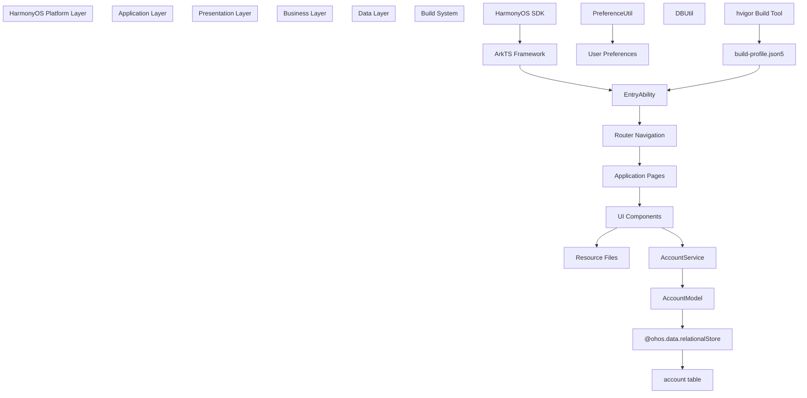

**Sources:** [README.md L3-L4](https://github.com/CassiopeiaCode/account_app_harmonyos/blob/b27fde23/README.md#L3-L4)

### Core Component Relationships

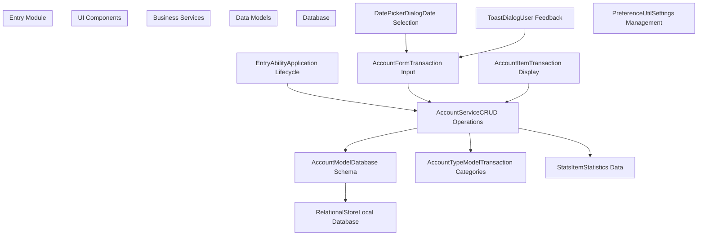

**Sources:** [README.md L3-L4](https://github.com/CassiopeiaCode/account_app_harmonyos/blob/b27fde23/README.md#L3-L4)

## Technology Stack

该应用程序基于以下核心技术框架构建：

| Component | Technology | Purpose |
| --- | --- | --- |
| Development Framework | HarmonyOS ArkTS Stage Model | Application development framework |
| Database | @ohos.data.relationalStore | Local relational database storage |
| Build System | hvigor | HarmonyOS application build tool |
| UI Framework | ArkTS UI Components | Native HarmonyOS user interface |
| Date Processing | dayjs | Date manipulation and formatting |
| Package Management | oh-package.json5 | Dependency management |

**Sources:** [README.md

3](https://github.com/CassiopeiaCode/account_app_harmonyos/blob/b27fde23/README.md#L3-L3)

## Core Features

### Transaction Management

该应用程序通过专用的用户界面组件和服务层提供全面的事务管理功能：

* **交易录入**：`AccountForm` 组件处理用户输入新交易
* **交易显示**：`AccountItem` 组件显示单个交易记录
* **数据持久化**：`AccountModel` 管理用于交易存储的数据库操作

### Data Statistics

统计分析及报告功能的实现方式如下：

* **基于时间的分组**：统计组件按时间段对交易进行分组
* **分类分析**：账户类型模型实现费用/收入分类
* **可视化报告**：统计信息标题提供交互式数据可视化控件

### Local Storage

该应用程序实现了一个健壮的本地存储系统：

* **关系型数据库**：使用HarmonyOS原生关系型存储实现数据持久化
* **用户偏好设置**：管理应用程序设置和用户配置
* **数据独立性**：无外部服务依赖，确保数据隐私

**Sources:** [README.md

4](https://github.com/CassiopeiaCode/account_app_harmonyos/blob/b27fde23/README.md#L4-L4)

## Project Structure

该应用遵循标准的鸿蒙系统项目结构，采用模块化组织：

```mermaid
flowchart TD

subgraph Resources ["Resources"]
end

subgraph Service_Layer ["Service Layer"]
end

subgraph Model_Layer ["Model Layer"]
end

subgraph Entry_Module ["Entry Module"]
end

subgraph Project_Root ["Project Root"]
end

AppConfig["app.json5App Metadata"]
BuildProfile["build-profile.json5Build Configuration"]
License["LICENSE.txtApache 2.0"]
EntryMain["entry/src/main/etsApplication Source"]
EntryAbilityFile["EntryAbility.etsApp Entry Point"]
Pages["pages/Application Pages"]
Components["components/UI Components"]
Models["model/Data Models"]
AccountModelFile["AccountModel.etsDatabase Operations"]
AccountTypeFile["AccountTypeModel.etsCategories"]
Services["service/Business Logic"]
AccountServiceFile["AccountService.etsTransaction Logic"]
PreferenceFile["PreferenceUtil.etsSettings"]
ResourcesDir["entry/src/main/resourcesApp Resources"]
Strings["string.jsonLocalization"]
Media["media/Images and Icons"]

    AppConfig --> EntryMain
    BuildProfile --> EntryMain
    EntryMain --> EntryAbilityFile
    EntryMain --> Pages
    EntryMain --> Components
    EntryMain --> Models
    EntryMain --> Services
    EntryMain --> ResourcesDir
```

**Sources:** [README.md L1-L20](https://github.com/CassiopeiaCode/account_app_harmonyos/blob/b27fde23/README.md#L1-L20)

 [LICENSE.txt L1-L202](https://github.com/CassiopeiaCode/account_app_harmonyos/blob/b27fde23/LICENSE.txt#L1-L202)

## 许可证与开发状态

该应用根据Apache License 2.0协议发布，允许商业和非商业用途的灵活应用。该项目是作者首次尝试HarmonyOS开发，并持续进行维护和优化改进。

**Sources:** [README.md L11-L16](https://github.com/CassiopeiaCode/account_app_harmonyos/blob/b27fde23/README.md#L11-L16)

 [LICENSE.txt L1-L202](https://github.com/CassiopeiaCode/account_app_harmonyos/blob/b27fde23/LICENSE.txt#L1-L202)

# Project-Configuration.md
# Project Configuration

> **Relevant source files**
> * [AppScope/app.json5](https://github.com/CassiopeiaCode/account_app_harmonyos/blob/b27fde23/AppScope/app.json5)
> * [build-profile.json5](https://github.com/CassiopeiaCode/account_app_harmonyos/blob/b27fde23/build-profile.json5)
> * [entry/build-profile.json5](https://github.com/CassiopeiaCode/account_app_harmonyos/blob/b27fde23/entry/build-profile.json5)
> * [entry/oh-package.json5](https://github.com/CassiopeiaCode/account_app_harmonyos/blob/b27fde23/entry/oh-package.json5)

本文件涵盖HarmonyOS会计助手应用的项目结构、构建配置、包管理及资源组织。详细说明了定义应用元数据、构建目标、SDK版本及依赖管理的配置文件。

关于应用入口点和生命周期管理的信息，请参见 [应用入口点](/CassiopeiaCode/account_app_harmonyos/3.1-application-entry-point)。关于具体构建流程和开发流程的详细信息，请参见 [开发环境](/CassiopeiaCode/account_app_harmonyos/7.1-development-environment)。

## Configuration File Architecture

项目配置由多个关键配置文件组成，这些文件定义了应用程序构建和部署过程的不同方面：

```

```

**Sources:** [AppScope/app.json5 L1-L11](https://github.com/CassiopeiaCode/account_app_harmonyos/blob/b27fde23/AppScope/app.json5#L1-L11)

 [build-profile.json5 L1-L27](https://github.com/CassiopeiaCode/account_app_harmonyos/blob/b27fde23/build-profile.json5#L1-L27)

 [entry/build-profile.json5 L1-L14](https://github.com/CassiopeiaCode/account_app_harmonyos/blob/b27fde23/entry/build-profile.json5#L1-L14)

 [entry/oh-package.json5 L1-L10](https://github.com/CassiopeiaCode/account_app_harmonyos/blob/b27fde23/entry/oh-package.json5#L1-L10)

## Application Metadata Configuration

应用元数据定义在AppScope目录下的`app.json5`文件中。该文件包含核心应用身份和版本信息：

| Configuration Key | Value | Purpose |
| --- | --- | --- |
| `bundleName` | `com.example.account_app` | Unique application identifier |
| `vendor` | `example` | Application vendor/publisher |
| `versionCode` | `1000000` | Numeric version for update management |
| `versionName` | `1.0.0` | Human-readable version string |
| `icon` | `$media:app_icon` | Reference to application icon resource |
| `label` | `$string:app_name` | Reference to localized application name |

该应用使用资源引用（$media: 和 $string:）来实现图标和标签的本地化与资源管理，通过HarmonyOS资源系统进行资源引用。

**Sources:** [AppScope/app.json5 L2-L9](https://github.com/CassiopeiaCode/account_app_harmonyos/blob/b27fde23/AppScope/app.json5#L2-L9)

## Build System Configuration

### Project-Level Build Profile

根文件 `build-profile.json5` 定义了项目级构建设置和模块组织：

```

```

The configuration specifies:

* **SDK 版本**：编译版本和兼容版本的 SDK 均设置为 9
* **签名配置**：用于开发构建的空 `signingConfigs` 数组
* **模块结构**：单个位于`./entry`路径的`entry`模块
* **构建产物**：默认产品配置，默认签名

**Sources:** [build-profile.json5 L2-L12](https://github.com/CassiopeiaCode/account_app_harmonyos/blob/b27fde23/build-profile.json5#L2-L12)

 [build-profile.json5 L13-L26](https://github.com/CassiopeiaCode/account_app_harmonyos/blob/b27fde23/build-profile.json5#L13-L26)

### Module-Level Build Profile

`entry/build-profile.json5` 定义了模块特定的构建设置：

| Setting | Value | Description |
| --- | --- | --- |
| `apiType` | `stageMode` | Uses HarmonyOS Stage Model API |
| `runtimeOS` | `HarmonyOS` | Target runtime environment |
| `targets` | `default`, `ohosTest` | Build targets for app and testing |

阶段模型API类型表明该应用使用现代HarmonyOS应用模型，具有改进的生命周期管理和组件架构。

**Sources:** [entry/build-profile.json5 L2-L13](https://github.com/CassiopeiaCode/account_app_harmonyos/blob/b27fde23/entry/build-profile.json5#L2-L13)

## Package Management

`entry/oh-package.json5` 文件管理入口模块的包元数据和依赖项：

```

```

The configuration shows:

* **自包含设计**：空的 `dependencies` 对象表示没有外部包依赖项
* **基础元数据**：基础包信息，带有占位符描述
* **本地开发**：缺少作者和许可证字段表明处于开发/示例状态

这与应用程序作为一款以本地优先的会计助手的设计理念一致，无需依赖外部服务。

**Sources:** [entry/oh-package.json5 L1-L9](https://github.com/CassiopeiaCode/account_app_harmonyos/blob/b27fde23/entry/oh-package.json5#L1-L9)

## Configuration Integration

配置文件协同工作以定义一个完整的HarmonyOS应用程序构建：

```

```

**Sources:** [AppScope/app.json5 L1-L11](https://github.com/CassiopeiaCode/account_app_harmonyos/blob/b27fde23/AppScope/app.json5#L1-L11)

 [build-profile.json5 L1-L27](https://github.com/CassiopeiaCode/account_app_harmonyos/blob/b27fde23/build-profile.json5#L1-L27)

 [entry/build-profile.json5 L1-L14](https://github.com/CassiopeiaCode/account_app_harmonyos/blob/b27fde23/entry/build-profile.json5#L1-L14)

 [entry/oh-package.json5 L1-L10](https://github.com/CassiopeiaCode/account_app_harmonyos/blob/b27fde23/entry/oh-package.json5#L1-L10)

# Application-Metadata.md
# Application Metadata

> **Relevant source files**
> * [AppScope/app.json5](https://github.com/CassiopeiaCode/account_app_harmonyos/blob/b27fde23/AppScope/app.json5)

本文档涵盖在`app.json5`中定义的应用元数据配置，该配置文件作为HarmonyOS记账助手应用的身份、版本控制和资源引用的核心配置文件。有关构建系统如何使用此元数据的信息，请参见[构建系统](/CassiopeiaCode/account_app_harmonyos/2.2-build-system)。有关图标、字符串等引用资源的详细信息，请参见[资源](/CassiopeiaCode/account_app_harmonyos/2.3-resources)。

## Configuration Structure

应用程序的元数据定义在 [AppScope/app.json5 L1-L10](https://github.com/CassiopeiaCode/account_app_harmonyos/blob/b27fde23/AppScope/app.json5#L1-L10)

使用一个包含所有必要应用身份和显示属性的单一`app`对象。该文件遵循HarmonyOS应用配置规范，并在HAP（HarmonyOS能力包）生成过程中作为包信息的权威来源。

### Application Metadata Schema

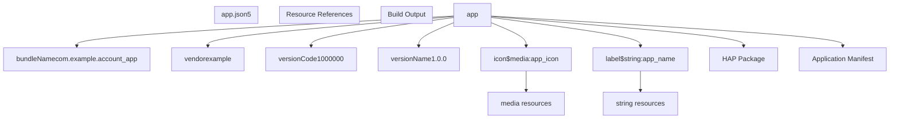

**Sources:** [AppScope/app.json5 L1-L10](https://github.com/CassiopeiaCode/account_app_harmonyos/blob/b27fde23/AppScope/app.json5#L1-L10)

## Bundle Identity Configuration

该应用的唯一标识通过 [AppScope/app.json5 L3-L4](https://github.com/CassiopeiaCode/account_app_harmonyos/blob/b27fde23/AppScope/app.json5#L3-L4) 中定义的 `bundleName` 和 `vendor` 属性确立。

包名`com.example.account_app`遵循反向域名命名规范，并在HarmonyOS生态中作为应用程序的主要标识符。

| Property | Value | Purpose |
| --- | --- | --- |
| `bundleName` | `com.example.account_app` | Unique application identifier |
| `vendor` | `example` | Application publisher identifier |

**Sources:** [AppScope/app.json5 L3-L4](https://github.com/CassiopeiaCode/account_app_harmonyos/blob/b27fde23/AppScope/app.json5#L3-L4)

## Version Management

版本信息是通过两个互补的属性来管理的，这两个属性使得程序层面和用户界面都能进行版本识别：

### Version Configuration Mapping

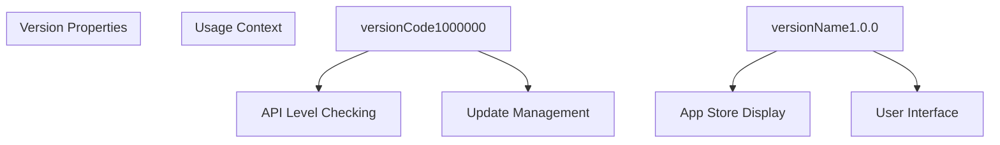

**Sources:** [AppScope/app.json5 L5-L6](https://github.com/CassiopeiaCode/account_app_harmonyos/blob/b27fde23/AppScope/app.json5#L5-L6)

* **versionCode** (`1000000`): 基于整数的版本标识符，用于系统更新管理和API兼容性检查
* **versionName** (`1.0.0`): 用户可读的版本字符串，显示给用户和应用商店

## Resource Reference System

元数据配置采用HarmonyOS资源引用语法，将显示属性与硬编码值解耦，从而实现本地化和主题支持。

### Resource Reference Structure

| Property | Reference Syntax | Target Resource Type |
| --- | --- | --- |
| `icon` | `$media:app_icon` | Media resource (PNG/SVG) |
| `label` | `$string:app_name` | Localized string resource |

`$media:` 和 `$string:` 前缀表示资源类型，并使构建系统能够在HAP编译过程中解析这些引用。这种方法允许：

* **本地化**：`app_name` 字符串可以在不修改元数据配置的情况下进行翻译
* **资产管理**：`app_icon` 可以在不更改配置的情况下进行更新或应用主题
* **构建时解析**：资源引用在构建过程中进行验证和解析

**Sources:** [AppScope/app.json5 L7-L8](https://github.com/CassiopeiaCode/account_app_harmonyos/blob/b27fde23/AppScope/app.json5#L7-L8)

# Build-System.md
# Build System

> **Relevant source files**
> * [build-profile.json5](https://github.com/CassiopeiaCode/account_app_harmonyos/blob/b27fde23/build-profile.json5)
> * [entry/build-profile.json5](https://github.com/CassiopeiaCode/account_app_harmonyos/blob/b27fde23/entry/build-profile.json5)
> * [entry/hvigorfile.ts](https://github.com/CassiopeiaCode/account_app_harmonyos/blob/b27fde23/entry/hvigorfile.ts)

本文档涵盖用于编译和打包HarmonyOS会计助手应用的基于hvigor的构建系统。它解释了构建配置文件、目标规范以及生成用于部署的HAP（HarmonyOS能力包）文件的过程。

关于应用元数据和捆绑配置的信息，请参见[应用元数据](/CassiopeiaCode/account_app_harmonyos/2.1-application-metadata)。关于项目资源和资产管理的详细信息，请参见[资源](/CassiopeiaCode/account_app_harmonyos/2.3-resources)。

## 构建工具和框架

该应用使用 **hvigor** 作为其主要构建工具，这是 HarmonyOS 应用的官方构建系统。该构建系统通过集成 `@ohos/hvigor-ohos-plugin` 提供针对 HarmonyOS 的特定编译能力。

### Hvigor Configuration

构建行为定义于 [entry/hvigorfile.ts L1-L3](https://github.com/CassiopeiaCode/account_app_harmonyos/blob/b27fde23/entry/hvigorfile.ts#L1-L3)

其从HarmonyOS插件导出`hapTasks`：

```
export { hapTasks } from '@ohos/hvigor-ohos-plugin';
```

此配置启用生成HAP包，即鸿蒙系统的可部署应用格式。

**Build System Architecture**

```

```

Sources: [entry/hvigorfile.ts L1-L3](https://github.com/CassiopeiaCode/account_app_harmonyos/blob/b27fde23/entry/hvigorfile.ts#L1-L3)

 [build-profile.json5 L1-L27](https://github.com/CassiopeiaCode/account_app_harmonyos/blob/b27fde23/build-profile.json5#L1-L27)

 [entry/build-profile.json5 L1-L14](https://github.com/CassiopeiaCode/account_app_harmonyos/blob/b27fde23/entry/build-profile.json5#L1-L14)

## Build Profile Configuration

构建系统采用两级配置方法，配置文件在项目根目录和模块级别均存在。

### Root Build Profile

The root [build-profile.json5 L1-L27](https://github.com/CassiopeiaCode/account_app_harmonyos/blob/b27fde23/build-profile.json5#L1-L27)

定义整体应用程序的构建设置：

| Configuration | Value | Description |
| --- | --- | --- |
| `compileSdkVersion` | 9 | HarmonyOS SDK version for compilation |
| `compatibleSdkVersion` | 9 | Minimum compatible SDK version |
| `signingConfigs` | `[]` | Empty array for default signing |

### Module Build Profile

[entry/build-profile.json5 L1-L14](https://github.com/CassiopeiaCode/account_app_harmonyos/blob/b27fde23/entry/build-profile.json5#L1-L14) 中的入口模块配置

 specifies:

| Setting | Value | Purpose |
| --- | --- | --- |
| `apiType` | `'stageMode'` | Uses HarmonyOS Stage Model API |
| `runtimeOS` | `"HarmonyOS"` | Target operating system |

**Build Configuration Hierarchy**

```

```

Sources: [build-profile.json5 L2-L12](https://github.com/CassiopeiaCode/account_app_harmonyos/blob/b27fde23/build-profile.json5#L2-L12)

 [build-profile.json5 L13-L26](https://github.com/CassiopeiaCode/account_app_harmonyos/blob/b27fde23/build-profile.json5#L13-L26)

 [entry/build-profile.json5 L2-L13](https://github.com/CassiopeiaCode/account_app_harmonyos/blob/b27fde23/entry/build-profile.json5#L2-L13)

## 构建目标与产品

构建系统定义了多个目标，以支持不同的部署场景：

### Product Configuration

[build-profile.json5 第6-11行](https://github.com/CassiopeiaCode/account_app_harmonyos/blob/b27fde23/build-profile.json5#L6-L11) 中的 `products` 数组

 defines build variants:

* **default**: 主要产品配置使用默认签名
* **signingConfig**：引用 "default" 签名配置

### Target Specifications

每个模块可以在[entry/build-profile.json5 L5-L13](https://github.com/CassiopeiaCode/account_app_harmonyos/blob/b27fde23/entry/build-profile.json5#L5-L13)中定义多个构建目标。

:

| Target | Runtime OS | Purpose |
| --- | --- | --- |
| `default` | HarmonyOS | Production deployment target |
| `ohosTest` | (inherited) | Testing and debugging target |

**Target and Product Mapping**

```

```

Sources: [build-profile.json5 L17-L24](https://github.com/CassiopeiaCode/account_app_harmonyos/blob/b27fde23/build-profile.json5#L17-L24)

 [entry/build-profile.json5 L6-L13](https://github.com/CassiopeiaCode/account_app_harmonyos/blob/b27fde23/entry/build-profile.json5#L6-L13)

模块结构与构建流程

构建系统将应用程序组织成模块，其中主要功能包含在`entry`模块中。

### Entry Module Configuration

入口模块在 [build-profile.json5 L14-L25](https://github.com/CassiopeiaCode/account_app_harmonyos/blob/b27fde23/build-profile.json5#L14-L25) 中定义

 with the following structure:

* **Module Name**: `entry`
* **Source Path**: `./entry`
* **构建目标**：通过 `applyToProducts` 配置映射到产品

### Build Process Flow

构建过程遵循以下步骤：

1. **配置加载**：从根目录和模块级别读取构建配置文件
2. **依赖解析**：处理包依赖和SDK需求
3. **源代码编译**：编译 ArkTS/TypeScript 源代码
4. **资源处理**：打包应用程序资源和资产
5. **HAP生成**：使用 `hapTasks` 创建可部署的HAP包

**Module Build Pipeline**

```

```

Sources: [build-profile.json5 L14-L25](https://github.com/CassiopeiaCode/account_app_harmonyos/blob/b27fde23/build-profile.json5#L14-L25)

 [entry/build-profile.json5 L1-L14](https://github.com/CassiopeiaCode/account_app_harmonyos/blob/b27fde23/entry/build-profile.json5#L1-L14)

 [entry/hvigorfile.ts L1-L3](https://github.com/CassiopeiaCode/account_app_harmonyos/blob/b27fde23/entry/hvigorfile.ts#L1-L3)

# Resources.md
# Resources

> **Relevant source files**
> * [AppScope/resources/base/element/string.json](https://github.com/CassiopeiaCode/account_app_harmonyos/blob/b27fde23/AppScope/resources/base/element/string.json)
> * [AppScope/resources/base/media/app_icon.png](https://github.com/CassiopeiaCode/account_app_harmonyos/blob/b27fde23/AppScope/resources/base/media/app_icon.png)

本文件涵盖HarmonyOS账户应用中的资源管理系统，包括字符串本地化、媒体资源以及应用资源的组织结构。该应用中的资源遵循HarmonyOS的国际化和资产管理规范。

关于处理这些资源的构建系统的信息，请参见[构建系统](/CassiopeiaCode/account_app_harmonyos/2.2-build-system)。关于资源在用户界面组件中的使用细节，请参见[用户界面组件](/CassiopeiaCode/account_app_harmonyos/5-user-interface-components)。

## Resource Directory Structure

该应用按照HarmonyOS标准在`AppScope/resources`目录结构中组织资源。这种分层组织方式支持本地化功能，并实现设备特定的资源变体。

### Resource Hierarchy

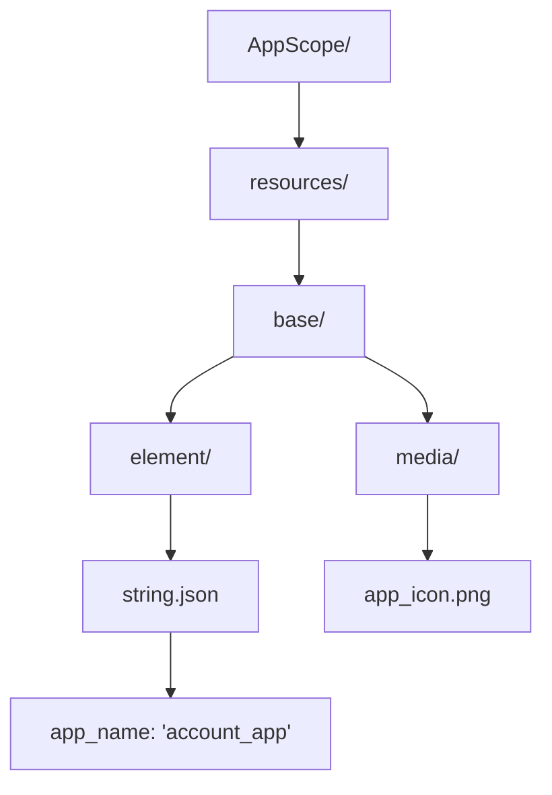

**Resource Directory Structure**

* `AppScope/resources/base/` - 适用于所有语言区域和设备配置的默认资源变体
* `AppScope/resources/base/element/` - 包含字符串和颜色等结构化数据资源
* `AppScope/resources/base/media/` - 包含图片和图标等二进制资源

Sources: [AppScope/resources/base/element/string.json L1-L8](https://github.com/CassiopeiaCode/account_app_harmonyos/blob/b27fde23/AppScope/resources/base/element/string.json#L1-L8)

 [AppScope/resources/base/media/app_icon.png

1](https://github.com/CassiopeiaCode/account_app_harmonyos/blob/b27fde23/AppScope/resources/base/media/app_icon.png#L1-L1)

## 字符串资源与本地化

应用程序在`element`目录内使用JSON格式定义字符串资源。字符串资源系统通过允许针对不同区域的多个资源变体来支持本地化。

### String Resource Definition

主字符串资源在`string.json`中定义，采用结构化格式：

| Resource Key | Value | Purpose |
| --- | --- | --- |
| `app_name` | `"account_app"` | Application display name |

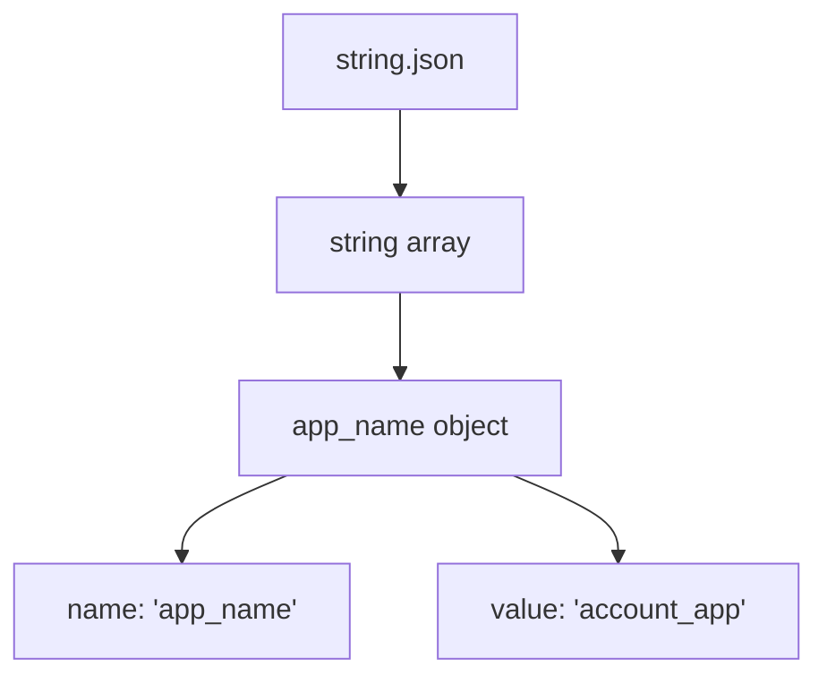

**String Resource Structure**

* 每个字符串资源包含一个 `name` 字段，用于资源标识符
* 每个字符串资源包含一个 `value` 字段，用于本地化文本
* 资源以JSON数组的形式组织在`string`键下

Sources: [AppScope/resources/base/element/string.json L1-L8](https://github.com/CassiopeiaCode/account_app_harmonyos/blob/b27fde23/AppScope/resources/base/element/string.json#L1-L8)

### Localization Support

资源系统设计为支持多种语言变体，尽管目前仅实现了基础语言。可以通过在`AppScope/resources/`下创建并行的目录结构来添加其他语言。

**Supported Localization Pattern:**

* `AppScope/resources/base/` - 默认备用资源
* `AppScope/resources/zh_CN/` - 简体中文（潜在）
* `AppScope/resources/en_US/` - 美国英语（潜在的）

## Media Assets

该应用程序包含存储在`media`目录中的视觉资源。这些资源由应用程序组件引用，并在构建过程中集成到最终的HAP包中。

### Application Icon

主要媒体资源是应用图标（`app_icon.png`），它作为应用程序在系统启动器和应用管理界面中的视觉标识。

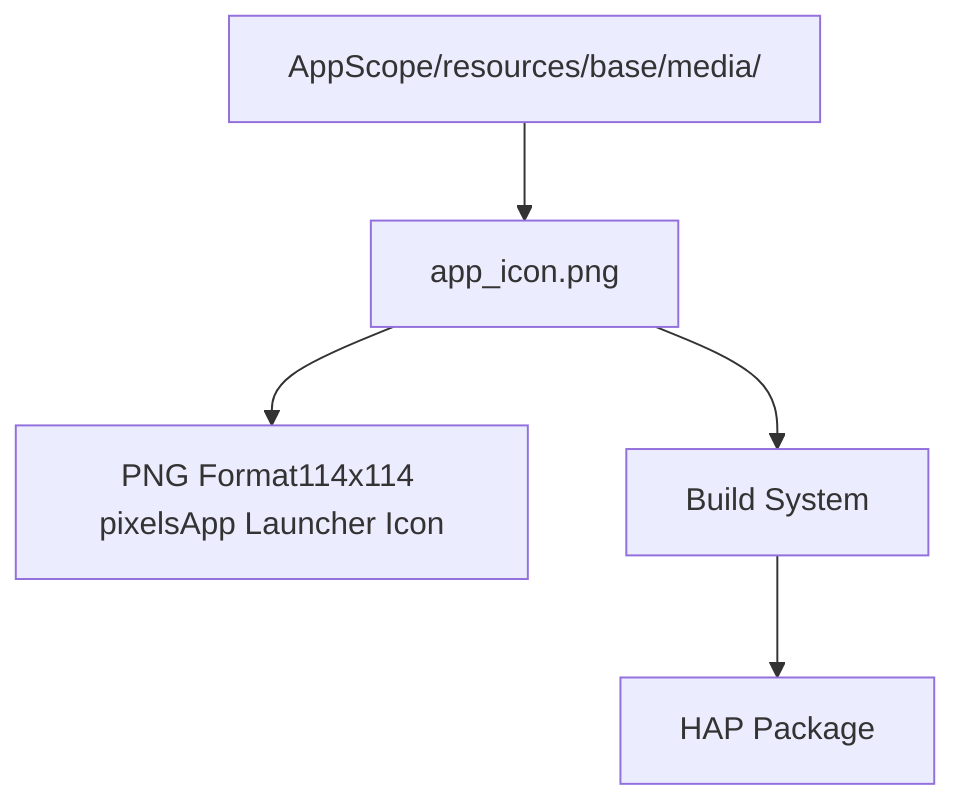

**Icon Specifications:**

* Format: PNG
* 尺寸：114x114像素（从文件头推断）
* 用途：应用程序启动器图标和系统识别
* 色彩深度：8位，带Alpha通道

Sources: [AppScope/resources/base/media/app_icon.png

1](https://github.com/CassiopeiaCode/account_app_harmonyos/blob/b27fde23/AppScope/resources/base/media/app_icon.png#L1-L1)

资源加载和使用

资源由HarmonyOS运行时加载，并通过资源管理API提供给应用组件。应用通过资源标识符访问这些资源。

### Resource Access Pattern

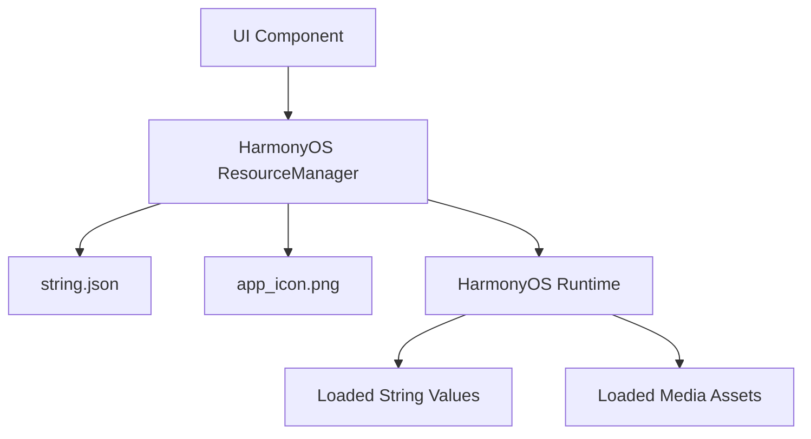

**Resource Access Workflow:**

1. 用户界面组件通过HarmonyOS资源管理器请求资源。
2. ResourceManager 根据设备的区域设置/配置定位适当的资源变体
3. 资源从编译后的HAP包中加载
4. 已加载的资源被提供给请求的组件

Sources: [AppScope/resources/base/element/string.json L1-L8](https://github.com/CassiopeiaCode/account_app_harmonyos/blob/b27fde23/AppScope/resources/base/element/string.json#L1-L8)

 [AppScope/resources/base/media/app_icon.png

1](https://github.com/CassiopeiaCode/account_app_harmonyos/blob/b27fde23/AppScope/resources/base/media/app_icon.png#L1-L1)

## Build System Integration

资源在应用构建过程中进行处理，并打包成最终的HAP文件。构建系统负责资源的编译、优化和打包，以供分发。

### Resource Build Flow

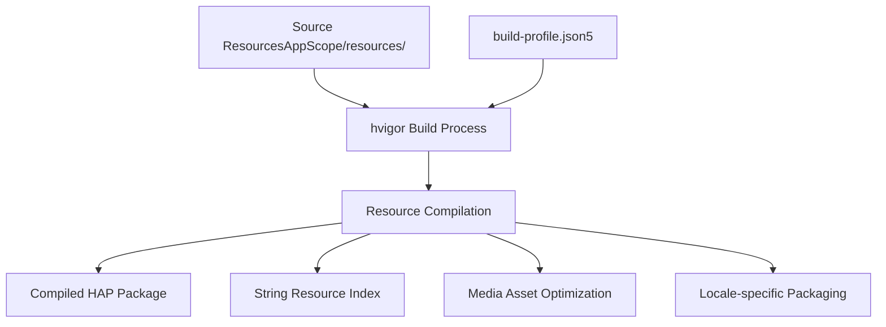

**Build Process Integration:**

* 原始资源由hvigor构建系统处理
字符串资源被索引以便运行时查找
* 媒体资源针对目标设备进行了优化
* 资源被打包到HAP中，并带有适当的元数据

Sources: [AppScope/resources/base/element/string.json L1-L8](https://github.com/CassiopeiaCode/account_app_harmonyos/blob/b27fde23/AppScope/resources/base/element/string.json#L1-L8)

 [AppScope/resources/base/media/app_icon.png

1](https://github.com/CassiopeiaCode/account_app_harmonyos/blob/b27fde23/AppScope/resources/base/media/app_icon.png#L1-L1)

## 资源管理最佳实践

当前资源结构展示了多个HarmonyOS资源组织与管理的最佳实践：

**Organizational Practices:**

* 元素资源（字符串、颜色）与媒体资源（图片、图标）的清晰分离
* 使用基础区域设置作为所有资源类型的后备
* 统一的资源标识符命名规范
* 结构化的JSON格式用于程序化资源访问

**Scalability Considerations:**

* 目录结构支持在不修改代码的情况下添加额外语言环境
资源命名允许易于识别和维护
媒体资源以适配移动应用程序的格式存储

Sources: [AppScope/resources/base/element/string.json L1-L8](https://github.com/CassiopeiaCode/account_app_harmonyos/blob/b27fde23/AppScope/resources/base/element/string.json#L1-L8)

 [AppScope/resources/base/media/app_icon.png

1](https://github.com/CassiopeiaCode/account_app_harmonyos/blob/b27fde23/AppScope/resources/base/media/app_icon.png#L1-L1)

# Application-Architecture.md
# Application Architecture

> **Relevant source files**
> * [entry/src/main/ets/common/constants.ets](https://github.com/CassiopeiaCode/account_app_harmonyos/blob/b27fde23/entry/src/main/ets/common/constants.ets)
> * [entry/src/main/ets/entryability/EntryAbility.ets](https://github.com/CassiopeiaCode/account_app_harmonyos/blob/b27fde23/entry/src/main/ets/entryability/EntryAbility.ets)

本文件全面概述了HarmonyOS会计助手应用的架构，包括入口点、生命周期管理及核心系统组织。内容涵盖构成应用基础的高层次结构设计模式、组件关系及初始化流程。

如需详细了解应用入口点实现，请参见 [应用入口点](/CassiopeiaCode/account_app_harmonyos/3.1-application-entry-point)。如需了解响应式设计模式，请参见 [响应式设计系统](/CassiopeiaCode/account_app_harmonyos/3.2-responsive-design-system)。如需了解具体的数据模型和数据库结构，请参见 [数据模型和数据库](/CassiopeiaCode/account_app_harmonyos/4-data-models-and-database)。

## System Architecture Overview

该应用采用专为HarmonyOS设计的分层架构模式，明确实现了UI层、业务逻辑层和数据持久层的职责分离。

### Core Architecture Diagram

```

```

Sources: [entry/src/main/ets/entryability/EntryAbility.ets L1-L51](https://github.com/CassiopeiaCode/account_app_harmonyos/blob/b27fde23/entry/src/main/ets/entryability/EntryAbility.ets#L1-L51)

### System Initialization Flow

该应用程序遵循一个特定的初始化序列，由`EntryAbility`类管理，该类作为主要生命周期协调器。

```

```

Sources: [entry/src/main/ets/entryability/EntryAbility.ets L9-L17](https://github.com/CassiopeiaCode/account_app_harmonyos/blob/b27fde23/entry/src/main/ets/entryability/EntryAbility.ets#L9-L17)

 [entry/src/main/ets/entryability/EntryAbility.ets L23-L34](https://github.com/CassiopeiaCode/account_app_harmonyos/blob/b27fde23/entry/src/main/ets/entryability/EntryAbility.ets#L23-L34)

## Application Lifecycle Management

`EntryAbility` 类继承自 HarmonyOS 的 `UIAbility`，并通过多个关键方法管理整个应用生命周期：

| Lifecycle Method | Purpose | Key Operations |
| --- | --- | --- |
| `onCreate` | Application initialization | Load preferences, initialize database, create tables |
| `onWindowStageCreate` | UI setup | Load main page content |
| `onForeground` | App activation | Resume active state |
| `onBackground` | App suspension | Handle background state |
| `onDestroy` | App termination | Cleanup resources |

### Initialization Dependencies

该应用程序具有必须保持的特定依赖项初始化顺序：

```

```

Sources: [entry/src/main/ets/entryability/EntryAbility.ets L10-L15](https://github.com/CassiopeiaCode/account_app_harmonyos/blob/b27fde23/entry/src/main/ets/entryability/EntryAbility.ets#L10-L15)

## 系统常量和配置

应用程序使用集中式常量进行系统范围的配置：

| Constant | Value | Purpose |
| --- | --- | --- |
| `H_STORE` | `'account_store'` | Database store identifier |
| `PREF_USER_FIRST_KEY` | `'userFirstUsed'` | First-time user preference key |

Sources: [entry/src/main/ets/common/constants.ets L1-L2](https://github.com/CassiopeiaCode/account_app_harmonyos/blob/b27fde23/entry/src/main/ets/common/constants.ets#L1-L2)

## Architectural Patterns

### Separation of Concerns

该应用程序在三个主要层之间实现了清晰的分离：

1. **表示层**：UI组件、页面和用户交互处理
2. **业务层**：服务、公用模块和业务逻辑处理
3. **数据层**：模型、数据库操作和数据持久化

### Dependency Injection Pattern

`EntryAbility` 作为依赖注入协调器，在应用程序启动时初始化核心服务，并在整个应用生命周期中使它们保持可用。

### Local-First Architecture

该应用程序采用本地优先设计模式，包括：

* 通过 `DBUtil` 和 `AccountModel` 实现本地关系型数据库存储
* 通过`PreferenceUtil`设置本地用户偏好
* 核心功能无外部API依赖

Sources: [entry/src/main/ets/entryability/EntryAbility.ets L4-L6](https://github.com/CassiopeiaCode/account_app_harmonyos/blob/b27fde23/entry/src/main/ets/entryability/EntryAbility.ets#L4-L6)

 [entry/src/main/ets/entryability/EntryAbility.ets L11-L15](https://github.com/CassiopeiaCode/account_app_harmonyos/blob/b27fde23/entry/src/main/ets/entryability/EntryAbility.ets#L11-L15)

# Application-Entry-Point.md
# Application Entry Point

> **Relevant source files**
> * [entry/src/main/ets/entryability/EntryAbility.ets](https://github.com/CassiopeiaCode/account_app_harmonyos/blob/b27fde23/entry/src/main/ets/entryability/EntryAbility.ets)

本文件介绍了鸿蒙系统会计助手应用的主要入口点，具体涉及管理应用生命周期、数据库初始化和初始页面加载的`EntryAbility`类。此类作为鸿蒙系统与应用业务逻辑之间的主要接口。

关于整体应用架构的信息，请参见[应用架构](/CassiopeiaCode/account_app_harmonyos/3-application-architecture)。关于数据库操作和模型的详细信息，请参见[数据库模式与操作](/CassiopeiaCode/account_app_harmonyos/4.3-database-schema-and-operations)。

## EntryAbility Class Overview

`EntryAbility` 类继承自 HarmonyOS 的 `UIAbility`，作为应用程序的主要入口点。它处理关键的初始化任务，包括数据库设置、偏好加载和初始页面路由。

**EntryAbility Class Structure**

```

```

Sources: [entry/src/main/ets/entryability/EntryAbility.ets L1-L51](https://github.com/CassiopeiaCode/account_app_harmonyos/blob/b27fde23/entry/src/main/ets/entryability/EntryAbility.ets#L1-L51)

## Application Lifecycle Management

`EntryAbility`类通过六个关键方法实现完整的HarmonyOS应用生命周期：

| Lifecycle Method | Purpose | Key Actions |
| --- | --- | --- |
| `onCreate` | App initialization | Database setup, preference loading |
| `onDestroy` | App termination | Cleanup and logging |
| `onWindowStageCreate` | Main window creation | Page loading and UI setup |
| `onWindowStageDestroy` | Main window destruction | UI resource cleanup |
| `onForeground` | App brought to foreground | Logging state change |
| `onBackground` | App moved to background | Logging state change |

**Application Lifecycle Flow**

```

```

Sources: [entry/src/main/ets/entryability/EntryAbility.ets L9-L49](https://github.com/CassiopeiaCode/account_app_harmonyos/blob/b27fde23/entry/src/main/ets/entryability/EntryAbility.ets#L9-L49)

数据库和偏好初始化

`onCreate`方法按特定顺序执行关键初始化任务，以确保应用在用户界面加载之前能够访问所需的数据存储系统。

**Initialization Sequence**

```

```

The initialization process includes:

1. **偏好设置加载**：调用`PreferenceUtil.loadPreference(this.context)`方法加载用户偏好和应用设置
2. **数据库初始化**：调用 `DBUtil.initDB(this.context)` 建立关系型数据库连接
3. **表创建**：调用 `DBUtil.createTable(AccountModel.getCreateTableSql())` 会根据 `AccountModel` 中定义的模式创建账户数据表

Sources: [entry/src/main/ets/entryability/EntryAbility.ets L10-L15](https://github.com/CassiopeiaCode/account_app_harmonyos/blob/b27fde23/entry/src/main/ets/entryability/EntryAbility.ets#L10-L15)

窗口和页面设置

`onWindowStageCreate`方法用于管理应用程序主窗口的创建并加载初始页面。该方法接收一个`WindowStage`对象，该对象提供了窗口管理的接口。

**Page Loading Process**

```

```

The page loading mechanism:

* 使用 `windowStage.loadContent('pages/Index', callback)` 加载主应用页面
* 实现错误处理以记录页面加载过程中的失败
* 记录成功页面加载的数据信息
* 路由到 `pages/Index` 页面作为应用程序的入口点

回调函数处理成功和错误情况，通过`hilog`系统提供详细日志记录，用于调试。

Sources: [entry/src/main/ets/entryability/EntryAbility.ets L23-L34](https://github.com/CassiopeiaCode/account_app_harmonyos/blob/b27fde23/entry/src/main/ets/entryability/EntryAbility.ets#L23-L34)

## 与应用组件的集成

`EntryAbility`类作为HarmonyOS平台与应用程序核心组件之间的集成点：

**Component Integration Map**

```

```

This integration ensures that:

* 用户偏好在用户界面初始化之前即可使用
* 数据库连接在生命周期早期建立
* 数据表在任何数据操作发生之前就已经存在。
* 主页可以访问已初始化的服务

Sources: [entry/src/main/ets/entryability/EntryAbility.ets L1-L6](https://github.com/CassiopeiaCode/account_app_harmonyos/blob/b27fde23/entry/src/main/ets/entryability/EntryAbility.ets#L1-L6)

 [entry/src/main/ets/entryability/EntryAbility.ets

27](https://github.com/CassiopeiaCode/account_app_harmonyos/blob/b27fde23/entry/src/main/ets/entryability/EntryAbility.ets#L27-L27)

# Responsive-Design-System.md
# Responsive Design System

> **Relevant source files**
> * [entry/src/main/ets/common/breakpoint.ets](https://github.com/CassiopeiaCode/account_app_harmonyos/blob/b27fde23/entry/src/main/ets/common/breakpoint.ets)

## Purpose and Scope

本文件介绍了HarmonyOS会计应用中使用的响应式设计系统，该系统通过基于断点的布局调整，为不同屏幕尺寸和设备方向提供自适应用户界面。该系统能够自动调整UI组件，以适配小、中、大屏幕设备。

关于使用此响应式系统的具体用户界面组件的信息，请参见 [用户界面组件](/CassiopeiaCode/account_app_harmonyos/5-user-interface-components)。关于应用级架构模式，请参见 [应用架构](/CassiopeiaCode/account_app_harmonyos/3-application-architecture)。

## Breakpoint System Overview

响应式设计系统围绕三个主要断点构建，这些断点根据视口宽度对设备进行分类：

| Breakpoint | Identifier | Width Range | Target Devices |
| --- | --- | --- | --- |
| Small | `sm` | 320vp ≤ width < 600vp | Phones, small tablets |
| Medium | `md` | 600vp ≤ width < 840vp | Large phones, small tablets |
| Large | `lg` | 840vp ≤ width | Tablets, desktop displays |

### 断点检测与存储

系统通过`CURRENT_BREAKPOINT`键采用集中式方法来管理当前设备断点状态，用于存储和检索。

```

```

Sources: [entry/src/main/ets/common/breakpoint.ets L18-L52](https://github.com/CassiopeiaCode/account_app_harmonyos/blob/b27fde23/entry/src/main/ets/common/breakpoint.ets#L18-L52)

## Breakpoint Type System

### BreakpointType Class Architecture

`BreakpointType<T>` 类提供了一个通用机制，用于定义在不同断点间变化的响应式值。这允许任何组件属性根据屏幕尺寸进行不同配置。

```

```

Sources: [entry/src/main/ets/common/breakpoint.ets L1-L17](https://github.com/CassiopeiaCode/account_app_harmonyos/blob/b27fde23/entry/src/main/ets/common/breakpoint.ets#L1-L17)

### Type-Safe Configuration Pattern

`BreakpointTypeOptions<T>` 接口通过要求所有断点值均为相同类型 `T` 来确保类型安全，同时允许对任何子集的断点进行可选配置。

## Responsive Configuration Constants

### Navigation Bar Configuration

系统定义了导航栏在不同屏幕尺寸下的响应式定位和方向行为：

| Configuration | Small Devices | Medium/Large Devices |
| --- | --- | --- |
| Bar Position | `BarPosition.End` | `BarPosition.Start` |
| Bar Vertical | `false` | `true` |

```

```

Sources: [entry/src/main/ets/common/breakpoint.ets L57-L70](https://github.com/CassiopeiaCode/account_app_harmonyos/blob/b27fde23/entry/src/main/ets/common/breakpoint.ets#L57-L70)

### Button Layout Configuration

该响应式系统包含针对添加按钮的位置和大小设置的特定配置：

| Property | Small (sm) | Medium (md) | Large (lg) |
| --- | --- | --- | --- |
| Stack Alignment | `Alignment.Bottom` | `Alignment.Start` | `Alignment.Start` |
| Stack Size | 60 | 100 | 120 |

### Content Area Configuration

最大内容宽度为响应式设计，以在不同设备上提供最佳阅读体验：

```

```

Sources: [entry/src/main/ets/common/breakpoint.ets L72-L91](https://github.com/CassiopeiaCode/account_app_harmonyos/blob/b27fde23/entry/src/main/ets/common/breakpoint.ets#L72-L91)

## Usage Patterns

### Configuration Retrieval Pattern

组件通过`getValue()`方法访问响应式配置，传递当前断点标识符：

```
// Example usage pattern
const currentBreakpoint = getCurrentBreakpoint();
const barPosition = BreakpointConstants.bar_position.getValue(currentBreakpoint);
const buttonSize = BreakpointConstants.addBtn_stack_size.getValue(currentBreakpoint);
```

### Breakpoint Detection Integration

系统通过使用定义的范围常量与HarmonyOS的媒体查询功能集成：

* `RANGE_SM`: `(320vp<=width<600vp)`
* `RANGE_MD`: `(600vp<=width<840vp)`
* `RANGE_LG`: `(840vp<=width)`

这些产品线旨在为HarmonyOS全系列设备提供最佳用户体验，涵盖从智能手机、平板电脑到更大尺寸的显示屏。

Sources: [entry/src/main/ets/common/breakpoint.ets L42-L52](https://github.com/CassiopeiaCode/account_app_harmonyos/blob/b27fde23/entry/src/main/ets/common/breakpoint.ets#L42-L52)

# Data-Models-and-Database.md
# 数据模型和数据库

> **Relevant source files**
> * [entry/src/main/ets/models/account/account.ets](https://github.com/CassiopeiaCode/account_app_harmonyos/blob/b27fde23/entry/src/main/ets/models/account/account.ets)
> * [entry/src/main/ets/models/account/accountModel.ets](https://github.com/CassiopeiaCode/account_app_harmonyos/blob/b27fde23/entry/src/main/ets/models/account/accountModel.ets)
> * [entry/src/main/ets/models/account/accountPO.ets](https://github.com/CassiopeiaCode/account_app_harmonyos/blob/b27fde23/entry/src/main/ets/models/account/accountPO.ets)

本文件涵盖HarmonyOS记账应用的数据层架构，包括账户交易模型、数据库模式设计、持久化对象表示以及增删改查操作。数据模型定义了财务交易、类别和统计聚合的结构。

关于使用这些模型的业务逻辑的信息，请参见 [服务与业务逻辑](/CassiopeiaCode/account_app_harmonyos/4-data-models-and-database)。关于显示此数据的用户界面组件的详细信息，请参见 [用户界面组件](/CassiopeiaCode/account_app_harmonyos/5-user-interface-components)。

## 核心数据接口和枚举

该应用程序定义了多个关键接口和枚举类型，用于表示金融交易数据及其分类。

账户类型和分类

该系统支持两种主要的交易类型，每种类型都有预定义的类别：

| Category Type | Enum | Purpose |
| --- | --- | --- |
| Expense Categories | `AccountExpensesType` | 16 predefined expense categories |
| Income Categories | `AccountIncomeType` | 8 predefined income categories |
| Transaction Direction | `AccountType` | EXPENSES or INCOME classification |

```

```

Sources: [entry/src/main/ets/models/account/account.ets L3-L33](https://github.com/CassiopeiaCode/account_app_harmonyos/blob/b27fde23/entry/src/main/ets/models/account/account.ets#L3-L33)

### Transaction Data Structure

`AccountInfo` 接口定义了金融交易数据的核心结构：

```

```

Sources: [entry/src/main/ets/models/account/account.ets L35-L41](https://github.com/CassiopeiaCode/account_app_harmonyos/blob/b27fde23/entry/src/main/ets/models/account/account.ets#L35-L41)

## 数据库模式与持久化

### Account Table Structure

该应用程序使用一个包含单一`account`表的本地关系型数据库用于交易存储：

```

```

该表是通过在`CREATE_TABLE_SQL`中定义的SQL语句创建的：

Sources: [entry/src/main/ets/models/account/accountModel.ets L10-L19](https://github.com/CassiopeiaCode/account_app_harmonyos/blob/b27fde23/entry/src/main/ets/models/account/accountModel.ets#L10-L19)

### Column Mapping Configuration

系统使用列映射配置来转换对象属性和数据库列：

| Object Property | Database Column | Data Type |
| --- | --- | --- |
| `id` | `id` | `ColumnType.LONG` |
| `type` | `type` | `ColumnType.LONG` |
| `accountType` | `account_type` | `ColumnType.LONG` |
| `amount` | `amount` | `ColumnType.DOUBLE` |
| `createTime` | `create_time` | `ColumnType.LONG` |
| `time` | `time` | `ColumnType.LONG` |
| `description` | `description` | `ColumnType.STRING` |

Sources: [entry/src/main/ets/models/account/account.ets L44-L54](https://github.com/CassiopeiaCode/account_app_harmonyos/blob/b27fde23/entry/src/main/ets/models/account/account.ets#L44-L54)

 [entry/src/main/ets/models/account/accountModel.ets L20-L28](https://github.com/CassiopeiaCode/account_app_harmonyos/blob/b27fde23/entry/src/main/ets/models/account/accountModel.ets#L20-L28)

### Persistent Object (AccountPO)

`AccountPO`类作为应用程序与数据库之间的数据传输对象：

```

```

Sources: [entry/src/main/ets/models/account/accountPO.ets L4-L33](https://github.com/CassiopeiaCode/account_app_harmonyos/blob/b27fde23/entry/src/main/ets/models/account/accountPO.ets#L4-L33)

## Data Access Layer

### AccountModel CRUD Operations

`AccountModel`类通过以下方法提供全面的数据库操作：

```

```

### Query Patterns

该模型支持两种主要的查询模式：

1. **日期范围查询**：使用 `queryByDateRange()` 检索特定时间段内的交易。
2. **过滤查询**：通过使用 `queryRangeAndType()` 方法按日期范围和交易类型检索交易

两种方法都使用`relationalStore.RdbPredicates`来构建SQL的WHERE子句。

Sources: [entry/src/main/ets/models/account/accountModel.ets L34-L78](https://github.com/CassiopeiaCode/account_app_harmonyos/blob/b27fde23/entry/src/main/ets/models/account/accountModel.ets#L34-L78)

## 统计与聚合模型

该应用程序定义了多个用于数据聚合和统计计算的接口：

### 分组与统计界面

```

```

### Data Aggregation Structure

| Interface | Purpose | Key Fields |
| --- | --- | --- |
| `ItemRecordInfo` | Enhanced record with type information | Includes `AccountTypeModel` for display |
| `GroupByDate` | Daily transaction summaries | `time`, `expenses`, `income`, `records[]` |
| `StatsByDate` | Date-based statistics | `time`, `expenses`, `income` totals |
| `StatsByType` | Category-based statistics | `amount`, `count`, `info` (category details) |

Sources: [entry/src/main/ets/models/account/account.ets L56-L84](https://github.com/CassiopeiaCode/account_app_harmonyos/blob/b27fde23/entry/src/main/ets/models/account/account.ets#L56-L84)

# Account-Data-Models.md
# Account Data Models

> **Relevant source files**
> * [entry/src/main/ets/models/account/account.ets](https://github.com/CassiopeiaCode/account_app_harmonyos/blob/b27fde23/entry/src/main/ets/models/account/account.ets)
> * [entry/src/main/ets/models/account/accountPO.ets](https://github.com/CassiopeiaCode/account_app_harmonyos/blob/b27fde23/entry/src/main/ets/models/account/accountPO.ets)

本文档涵盖了定义HarmonyOS会计应用中财务交易数据结构的核心数据模型、接口和枚举。这些模型作为整个应用程序中数据表示的基础。

关于预定义账户分类及其视觉表示的信息，请参见 [账户类型和分类](/CassiopeiaCode/account_app_harmonyos/4.2-account-types-and-categories)。关于数据库操作和模式细节，请参见 [数据库模式和操作](/CassiopeiaCode/account_app_harmonyos/4.3-database-schema-and-operations)。关于统计和聚合模型，请参见 [统计模型](/CassiopeiaCode/account_app_harmonyos/4.4-statistics-models)。

## 核心账户数据结构

该应用程序定义了几个基本接口，用于表示账户信息和财务交易。

### AccountInfo Interface

`AccountInfo` 接口代表金融交易的核心结构：

| Field | Type | Description |
| --- | --- | --- |
| `type` | `AccountExpensesType` \| `AccountIncomeType` | Specific category of the transaction |
| `accountType` | `AccountType` | Whether transaction is expense or income |
| `amount` | `number` | Transaction amount |
| `time` | `number` | Transaction timestamp |
| `description` | `string` (optional) | Additional transaction details |

### ItemRecordInfo Interface

`ItemRecordInfo` 接口在基础账户信息的基础上扩展了数据库元数据：

| Field | Type | Description |
| --- | --- | --- |
| `id` | `number` | Database record identifier |
| `type` | `number` | Numeric representation of transaction type |
| `accountType` | `number` | Numeric representation of account type |
| `description` | `string` (optional) | Transaction description |
| `createTime` | `number` | Record creation timestamp |
| `amount` | `number` | Transaction amount |
| `time` | `number` | Transaction date timestamp |
| `info` | `AccountTypeModel` | Associated account type model |

**Sources:** [entry/src/main/ets/models/account/account.ets L35-L41](https://github.com/CassiopeiaCode/account_app_harmonyos/blob/b27fde23/entry/src/main/ets/models/account/account.ets#L35-L41)

 [entry/src/main/ets/models/account/account.ets L56-L65](https://github.com/CassiopeiaCode/account_app_harmonyos/blob/b27fde23/entry/src/main/ets/models/account/account.ets#L56-L65)

## Transaction Type Enumerations

### Account Type Classification

```

```

### Expense Categories

`AccountExpensesType` 枚举定义了13个费用类别：

| Enum Value | Chinese Description | Purpose |
| --- | --- | --- |
| `MEALS` | 餐食 | Food and dining expenses |
| `MEDICAL` | 医疗 | Healthcare and medical costs |
| `TRANSPORT` | 交通 | Transportation expenses |
| `HOUSE` | 住房 | Housing and rent costs |
| `TOBACCO` | 烟酒零食 | Tobacco, alcohol, and snacks |
| `STUDY` | 学习 | Education and learning expenses |
| `COMMUNICATE` | 通讯 | Communication costs |
| `SOCIAL` | 社交 | Social activities |
| `INVEST` | 投资 | Investment expenses |
| `SHOPPING` | 购物 | Shopping and retail purchases |
| `ENTERTAINMENT` | 娱乐 | Entertainment expenses |
| `LOAN` | 外借 | Money lent to others |
| `OTHER` | 其他 | Miscellaneous expenses |

### Income Categories

`AccountIncomeType` 枚举定义了8个收入类别：

| Enum Value | Chinese Description | Purpose |
| --- | --- | --- |
| `SALARY` | 工资 | Regular salary income |
| `BONUS` | 奖金 | Bonus payments |
| `INTEREST` | 利息 | Interest earnings |
| `INVEST` | 投资 | Investment returns |
| `PART_TIME` | 兼职 | Part-time work income |
| `RED_ENVELOP` | 红包转账 | Red envelope transfers |
| `BORROW` | 借入 | Money borrowed |
| `OTHER` | 其他 | Miscellaneous income |

**Sources:** [entry/src/main/ets/models/account/account.ets L3-L33](https://github.com/CassiopeiaCode/account_app_harmonyos/blob/b27fde23/entry/src/main/ets/models/account/account.ets#L3-L33)

## Database Mapping Interfaces

### Column Type Definitions

`ColumnType` 枚举定义了数据库列的数据类型：

```

```

### ColumnInfo Interface

`ColumnInfo`接口将对象属性映射到数据库列：

| Field | Type | Description |
| --- | --- | --- |
| `name` | `string` | Object property name |
| `columnName` | `string` | Database column name |
| `type` | `ColumnType` | Database column data type |

**Sources:** [entry/src/main/ets/models/account/account.ets L44-L54](https://github.com/CassiopeiaCode/account_app_harmonyos/blob/b27fde23/entry/src/main/ets/models/account/account.ets#L44-L54)

## Data Aggregation Interfaces

### GroupByDate Interface

`GroupByDate` 接口表示按日期分组的交易：

| Field | Type | Description |
| --- | --- | --- |
| `time` | `number` | Date timestamp |
| `expenses` | `number` | Total expenses for the date |
| `income` | `number` | Total income for the date |
| `records` | `ItemRecordInfo[]` | Array of transaction records |

### StatsByDate Interface

`StatsByDate` 接口表示每日统计数据：

| Field | Type | Description |
| --- | --- | --- |
| `time` | `number` | Date timestamp |
| `expenses` | `number` | Total expenses |
| `income` | `number` | Total income |

### StatsByType Interface

`StatsByType` 接口代表按交易类型统计的信息：

| Field | Type | Description |
| --- | --- | --- |
| `amount` | `number` | Total amount for the type |
| `count` | `number` | Number of transactions |
| `info` | `AccountTypeModel` | Associated account type model |

**Sources:** [entry/src/main/ets/models/account/account.ets L67-L84](https://github.com/CassiopeiaCode/account_app_harmonyos/blob/b27fde23/entry/src/main/ets/models/account/account.ets#L67-L84)

## Persistent Object Model

### AccountPO Class

```

```

`AccountPO`类作为用于数据库存储的持久化对象，具有以下属性：

| Property | Type | Description | Database Role |
| --- | --- | --- | --- |
| `id` | `number` (optional) | Record identifier | Primary key |
| `type` | `number` | Transaction type | Foreign key reference |
| `accountType` | `number` | Account type | Category indicator |
| `description` | `string` (optional) | Transaction description | Text field |
| `createTime` | `number` (optional) | Record creation time | Metadata |
| `amount` | `number` | Transaction amount | Numeric value |
| `time` | `number` | Transaction date | Date index |

`AccountPO`类使用枚举值的数值表示，以优化数据库存储和查询性能。

**Sources:** [entry/src/main/ets/models/account/accountPO.ets L1-L33](https://github.com/CassiopeiaCode/account_app_harmonyos/blob/b27fde23/entry/src/main/ets/models/account/accountPO.ets#L1-L33)

# Account-Types-and-Categories.md
# 账户类型与分类

> **Relevant source files**
> * [entry/src/main/ets/models/accountType/AccountTypeModel.ets](https://github.com/CassiopeiaCode/account_app_harmonyos/blob/b27fde23/entry/src/main/ets/models/accountType/AccountTypeModel.ets)
> * [entry/src/main/ets/models/accountType/accountType.ets](https://github.com/CassiopeiaCode/account_app_harmonyos/blob/b27fde23/entry/src/main/ets/models/accountType/accountType.ets)

本文件描述了用于在鸿蒙OS会计助手应用中对财务交易进行分类的预定义账户类型和分类系统。该系统为费用和收入提供结构化的分类，并包含图标和颜色等相关的视觉元素。

关于核心账户数据接口和交易类型的更多信息，请参见[账户数据模型](/CassiopeiaCode/account_app_harmonyos/4.1-account-data-models)。关于账户类型信息的数据库存储详情，请参见[数据库模式与操作](/CassiopeiaCode/account_app_harmonyos/4.3-database-schema-and-operations)。

## 账户类型模型结构

账户类型系统是围绕`AccountTypeModel`类构建的，该类定义了所有账户类别的结构。每个账户类型包含标识信息、本地化信息和视觉呈现数据。

### AccountTypeModel Class

`AccountTypeModel` 是所有账户类别的基础：

| Property | Type | Purpose |
| --- | --- | --- |
| `id` | `number` | Unique identifier matching enum values |
| `name` | `ResourceStr` | Localized display name from string resources |
| `icon` | `ResourceStr` | Resource reference to category icon |
| `activeColor` | `ResourceStr` | Color resource for active/selected state |

```

```

**Sources:** [entry/src/main/ets/models/accountType/AccountTypeModel.ets L4-L28](https://github.com/CassiopeiaCode/account_app_harmonyos/blob/b27fde23/entry/src/main/ets/models/accountType/AccountTypeModel.ets#L4-L28)

## Expense Categories

该应用程序提供了13个预定义的支出类别，涵盖常见的消费领域。每个支出类别对应一个`AccountExpensesType`枚举值，并包含本地化资源。

### Expense Category Mapping

```

```

完整的支出分类列表

| Category | String Resource | Icon Resource | Color |
| --- | --- | --- | --- |
| `MEALS` | `app.string.diet` | `app.media.meals` | `app.color.yellow` |
| `MEDICAL` | `app.string.healthy` | `app.media.medical` | `app.color.green` |
| `TRANSPORT` | `app.string.transport` | `app.media.traffic` | `app.color.blue` |
| `HOUSE` | `app.string.house` | `app.media.house` | `app.color.blue` |
| `TOBACCO` | `app.string.snack` | `app.media.tobacco` | `app.color.yellow` |
| `STUDY` | `app.string.study` | `app.media.educate` | `app.color.blue` |
| `COMMUNICATE` | `app.string.communicate` | `app.media.communication` | `app.color.blue` |
| `SOCIAL` | `app.string.social` | `app.media.social` | `app.color.purple` |
| `INVEST` | `app.string.investment_expenditure` | `app.media.invest` | `app.color.green` |
| `SHOPPING` | `app.string.shopping` | `app.media.shoping` | `app.color.purple` |
| `ENTERTAINMENT` | `app.string.entertainment` | `app.media.game` | `app.color.red` |
| `LOAN` | `app.string.loan` | `app.media.loan` | `app.color.green` |
| `OTHER` | `app.string.other_expenses` | `app.media.other` | `app.color.green` |

**Sources:** [entry/src/main/ets/models/accountType/accountType.ets L4-L18](https://github.com/CassiopeiaCode/account_app_harmonyos/blob/b27fde23/entry/src/main/ets/models/accountType/accountType.ets#L4-L18)

## Income Categories

系统定义了8个收入类别，代表各种收入来源。每个收入类别对应一个`AccountIncomeType`枚举值。

### Income Category Structure

```

```

### 完整收入分类列表

| Category | String Resource | Icon Resource | Color |
| --- | --- | --- | --- |
| `SALARY` | `app.string.salary` | `app.media.salary` | `app.color.green` |
| `BONUS` | `app.string.bonus` | `app.media.bonus` | `app.color.orange` |
| `INTEREST` | `app.string.interest` | `app.media.Interest` | `app.color.yellow` |
| `INVEST` | `app.string.invest` | `app.media.invest` | `app.color.red` |
| `PART_TIME` | `app.string.part_time` | `app.media.part_time` | `app.color.blue` |
| `RED_ENVELOP` | `app.string.red_envelope` | `app.media.red_envalope` | `app.color.red` |
| `BORROW` | `app.string.borrow` | `app.media.borrow` | `app.color.purple` |
| `OTHER` | `app.string.other_income` | `app.media.other` | `app.color.green` |

**Sources:** [entry/src/main/ets/models/accountType/accountType.ets L20-L29](https://github.com/CassiopeiaCode/account_app_harmonyos/blob/b27fde23/entry/src/main/ets/models/accountType/accountType.ets#L20-L29)

## 类别访问与检索

系统通过`AccountTypeItem`类及其单例实例`accountTypeItem`提供对账户类型信息的集中访问。

### AccountTypeItem Implementation

```

```

`getById` 方法提供类型安全的账户类别访问方式：

* **Parameters:**
`id`: 类别标识符，对应枚举值
* `type`: `AccountType.EXPENSES` 或 `AccountType.INCOME`
* **返回:** 对应的 `AccountTypeModel` 实例
* **逻辑：** 返回 `expenses[id]` 用于支出类型，`incomes[id]` 用于收入类型

**Sources:** [entry/src/main/ets/models/accountType/accountType.ets L31-L38](https://github.com/CassiopeiaCode/account_app_harmonyos/blob/b27fde23/entry/src/main/ets/models/accountType/accountType.ets#L31-L38)

## Visual Design System

账户分类采用全面的视觉设计系统，通过颜色编码和图标设计来提升用户体验和分类识别。

### Color Distribution

| Color | Usage Count | Categories |
| --- | --- | --- |
| `app.color.blue` | 4 | Transport, House, Study, Communication, Part-time |
| `app.color.green` | 4 | Medical, Investment (expense), Loan, Other (expense), Salary, Other (income) |
| `app.color.yellow` | 2 | Meals, Tobacco, Interest |
| `app.color.purple` | 2 | Social, Shopping, Borrow |
| `app.color.red` | 2 | Entertainment, Investment (income), Red Envelope |
| `app.color.orange` | 1 | Bonus |

### Resource Dependencies

账户类型系统依赖于三个资源类别：

* **字符串资源：** 本地化的分类名称位于 `app.string.*` 中。
* **媒体资源：** 分类图标位于 `app.media.*`
* **颜色资源：** 分类颜色位于 `app.color.*`

**Sources:** [entry/src/main/ets/models/accountType/accountType.ets L4-L29](https://github.com/CassiopeiaCode/account_app_harmonyos/blob/b27fde23/entry/src/main/ets/models/accountType/accountType.ets#L4-L29)

# Database-Schema-and-Operations.md
# 数据库模式与操作

> **Relevant source files**
> * [entry/src/main/ets/models/account/accountModel.ets](https://github.com/CassiopeiaCode/account_app_harmonyos/blob/b27fde23/entry/src/main/ets/models/account/accountModel.ets)

## Purpose and Scope

本文件涵盖HarmonyOS会计应用的数据库模式设计及数据库操作实现。详细说明了`account`表结构、通过`AccountModel`类实现的增删改查操作，以及与HarmonyOS关系型存储API的集成，用于本地数据持久化。

关于账户数据结构和接口的信息，请参见 [账户数据模型](/CassiopeiaCode/account_app_harmonyos/4.1-account-data-models)。关于账户类型分类的详细信息，请参见 [账户类型与分类](/CassiopeiaCode/account_app_harmonyos/4.2-account-types-and-categories)。关于数据聚合与报告模型，请参见 [统计模型](/CassiopeiaCode/account_app_harmonyos/4.4-statistics-models)。

## Database Schema Structure

该应用程序使用一个名为`account`的表来存储所有财务交易记录。模式定义在`CREATE_TABLE_SQL`常量中，并支持全面的交易追踪。

### Account Table Schema

```

```

**Schema Definition:** [entry/src/main/ets/models/account/accountModel.ets L10-L19](https://github.com/CassiopeiaCode/account_app_harmonyos/blob/b27fde23/entry/src/main/ets/models/account/accountModel.ets#L10-L19)

The table structure includes:

| Column | Type | Constraints | Purpose |
| --- | --- | --- | --- |
| `id` | INTEGER | PRIMARY KEY AUTOINCREMENT | Unique record identifier |
| `type` | INTEGER | NOT NULL | Transaction type (expense/income) |
| `account_type` | INTEGER | NOT NULL | Specific category of transaction |
| `amount` | DOUBLE | NOT NULL | Transaction monetary value |
| `create_time` | INTEGER | NOT NULL | Record creation timestamp |
| `time` | INTEGER | NOT NULL | Actual transaction date |
| `description` | STRING | Optional | User-provided transaction notes |

**Sources:** [entry/src/main/ets/models/account/accountModel.ets L10-L19](https://github.com/CassiopeiaCode/account_app_harmonyos/blob/b27fde23/entry/src/main/ets/models/account/accountModel.ets#L10-L19)

### Column Mapping Configuration

该应用程序使用列映射系统来实现对象属性与数据库列之间的转换：

```

```

**Sources:** [entry/src/main/ets/models/account/accountModel.ets L20-L28](https://github.com/CassiopeiaCode/account_app_harmonyos/blob/b27fde23/entry/src/main/ets/models/account/accountModel.ets#L20-L28)

## Database Operations Architecture

数据库操作通过分层架构实现，使用`AccountModel`类作为主要接口。

### Database Layer Architecture

```

```

**Sources:** [entry/src/main/ets/models/account/accountModel.ets L1-L78](https://github.com/CassiopeiaCode/account_app_harmonyos/blob/b27fde23/entry/src/main/ets/models/account/accountModel.ets#L1-L78)

## CRUD Operations Implementation

`AccountModel`类提供了用于管理账户记录的完整CRUD操作集。

### Create Operations

**Insert Method:** [entry/src/main/ets/models/account/accountModel.ets L39-L41](https://github.com/CassiopeiaCode/account_app_harmonyos/blob/b27fde23/entry/src/main/ets/models/account/accountModel.ets#L39-L41)

`insert`方法接受一个`AccountPO`对象，并委托给`DBUtil.insert`，传递表名、记录数据和列映射配置。

### Read Operations

该模型提供了两种专门的查询方法：

**日期范围查询：** [entry/src/main/ets/models/account/accountModel.ets L49-L56](https://github.com/CassiopeiaCode/account_app_harmonyos/blob/b27fde23/entry/src/main/ets/models/account/accountModel.ets#L49-L56)

* 在指定的日期范围内检索记录
* 使用 `大于等于` 和 `小于等于` 谓词在 `time` 列上

**日期范围和类型查询：** [entry/src/main/ets/models/account/accountModel.ets L58-L67](https://github.com/CassiopeiaCode/account_app_harmonyos/blob/b27fde23/entry/src/main/ets/models/account/accountModel.ets#L58-L67)

* 结合日期范围筛选与账户类型筛选
* 使用带有and()操作的复合谓词
* 按 `account_type` 列筛选特定的交易类别

### Update Operations

**Update Method:** [entry/src/main/ets/models/account/accountModel.ets L69-L73](https://github.com/CassiopeiaCode/account_app_harmonyos/blob/b27fde23/entry/src/main/ets/models/account/accountModel.ets#L69-L73)

通过ID更新现有记录，使用`RdbPredicates.equalTo`在`id`列上。

### Delete Operations

**按ID删除方法：** [entry/src/main/ets/models/account/accountModel.ets L43-L47](https://github.com/CassiopeiaCode/account_app_harmonyos/blob/b27fde23/entry/src/main/ets/models/account/accountModel.ets#L43-L47)

通过`RdbPredicates.equalTo`使用基于ID的谓词删除记录。

## Query Predicate System

该应用使用HarmonyOS `RdbPredicates` 构建带有类型安全条件的数据库查询。

### Predicate Construction Pattern

```

```

**Sources:** [entry/src/main/ets/models/account/accountModel.ets L49-L67](https://github.com/CassiopeiaCode/account_app_harmonyos/blob/b27fde23/entry/src/main/ets/models/account/accountModel.ets#L49-L67)

### Column Constants

该模型定义列常量以实现一致的数据库访问：

* `TABLE_NAME`: `'account'` [entry/src/main/ets/models/account/accountModel.ets

29](https://github.com/CassiopeiaCode/account_app_harmonyos/blob/b27fde23/entry/src/main/ets/models/account/accountModel.ets#L29-L29)
* `ID_COLUMN`: `'id'` [entry/src/main/ets/models/account/accountModel.ets

30](https://github.com/CassiopeiaCode/account_app_harmonyos/blob/b27fde23/entry/src/main/ets/models/account/accountModel.ets#L30-L30)
* `DATE_COLUMN`: `'time'` [entry/src/main/ets/models/account/accountModel.ets

31](https://github.com/CassiopeiaCode/account_app_harmonyos/blob/b27fde23/entry/src/main/ets/models/account/accountModel.ets#L31-L31)
* `TYPE_COLUMN`: `'account_type'` [entry/src/main/ets/models/account/accountModel.ets

32](https://github.com/CassiopeiaCode/account_app_harmonyos/blob/b27fde23/entry/src/main/ets/models/account/accountModel.ets#L32-L32)

## Database Integration Points

### HarmonyOS RelationalStore Integration

`AccountModel` 通过以下方式与 HarmonyOS 平台服务集成：

* **Import Declaration:** [entry/src/main/ets/models/account/accountModel.ets

2](https://github.com/CassiopeiaCode/account_app_harmonyos/blob/b27fde23/entry/src/main/ets/models/account/accountModel.ets#L2-L2)
* **谓词使用：** 在类型安全的数据库操作查询方法中贯穿应用
* **DBUtil 抽象层：** 将实际的数据库操作委托给工具层

### Type System Integration

该模型与应用程序的类型系统集成：

* **AccountType Import:** [entry/src/main/ets/models/account/accountModel.ets

3](https://github.com/CassiopeiaCode/account_app_harmonyos/blob/b27fde23/entry/src/main/ets/models/account/accountModel.ets#L3-L3)
* **ColumnInfo 用法：** 用于对象属性与数据库列之间的映射
* **AccountPO Integration:** [entry/src/main/ets/models/account/accountModel.ets

4](https://github.com/CassiopeiaCode/account_app_harmonyos/blob/b27fde23/entry/src/main/ets/models/account/accountModel.ets#L4-L4)

 for data transfer objects

**Sources:** [entry/src/main/ets/models/account/accountModel.ets L1-L78](https://github.com/CassiopeiaCode/account_app_harmonyos/blob/b27fde23/entry/src/main/ets/models/account/accountModel.ets#L1-L78)

# Statistics-Models.md
# Statistics Models

> **Relevant source files**
> * [entry/src/main/ets/models/stats/StatsItem.ets](https://github.com/CassiopeiaCode/account_app_harmonyos/blob/b27fde23/entry/src/main/ets/models/stats/StatsItem.ets)
> * [entry/src/main/ets/models/stats/stats.ets](https://github.com/CassiopeiaCode/account_app_harmonyos/blob/b27fde23/entry/src/main/ets/models/stats/stats.ets)

本文件涵盖会计应用程序中用于统计和报告功能的数据模型和枚举。这些模型提供了时间周期分类、日期范围生成以及财务交易统计分析的数据结构定义。

有关底层账户数据模型的信息，请参见[账户数据模型](/CassiopeiaCode/account_app_harmonyos/4.1-account-data-models)。对于使用这些模型的统计UI组件，请参见[统计组件](/CassiopeiaCode/account_app_harmonyos/5.3-statistics-components)。

## Core Statistics Enums

统计系统定义了两个基本枚举类型，用于控制数据的分类和显示方式。

### StatsType Enumeration

`StatsType` 枚举定义了统计视图的时间周期粒度：

| Value | Purpose |
| --- | --- |
| `MONTH` | Monthly statistics view |
| `YEAR` | Yearly statistics view |

### CategoryType Enumeration

`CategoryType` 枚举定义了在统计展示中交易的分组方式：

| Value | Purpose |
| --- | --- |
| `DATE` | Group transactions by date |
| `TYPE` | Group transactions by account type category |

Sources: [entry/src/main/ets/models/stats/stats.ets L1-L9](https://github.com/CassiopeiaCode/account_app_harmonyos/blob/b27fde23/entry/src/main/ets/models/stats/stats.ets#L1-L9)

## Data Structures

### OptionsItem Interface

`OptionsItem<T>` 接口为贯穿整个统计系统的下拉菜单和选择器选项提供了通用结构：

```
interface OptionsItem<T> {
  label: string;  // Display text
  value: T;       // Underlying value
}
```

此接口为日期选择和分类过滤组件提供了类型安全的选项列表。

### StatsItem Class

StatsItem类包含用于根据应用使用模式生成时间段选项的静态工具方法。

Sources: [entry/src/main/ets/models/stats/StatsItem.ets L4-L7](https://github.com/CassiopeiaCode/account_app_harmonyos/blob/b27fde23/entry/src/main/ets/models/stats/StatsItem.ets#L4-L7)

 [entry/src/main/ets/models/stats/StatsItem.ets L8-L24](https://github.com/CassiopeiaCode/account_app_harmonyos/blob/b27fde23/entry/src/main/ets/models/stats/StatsItem.ets#L8-L24)

## 日期范围生成逻辑

时间段选项生成

`getStatsTypeDateList` 方法根据统计数据类型和应用首次使用时间戳生成相应的日期选项：

**Monthly Statistics Generation**

* 创建从“1月”到“12月”的12个月选项
* 每个选项的数值范围是0到11
* 用于按月份筛选特定年份内的交易

**Yearly Statistics Generation**

* 从`firstUseTime`参数计算起始年份（默认为2020年）
* 从起始年份到当前年份生成年份选项
* 每个标记为“{年}年”的选项，年份以数字形式表示。
* 支持跨多年的历史数据分析

日期范围逻辑流程

```

```

Sources: [entry/src/main/ets/models/stats/StatsItem.ets L9-L23](https://github.com/CassiopeiaCode/account_app_harmonyos/blob/b27fde23/entry/src/main/ets/models/stats/StatsItem.ets#L9-L23)

## Statistics Model Relationships

### Model Integration Architecture

```

```

Sources: [entry/src/main/ets/models/stats/stats.ets L1-L9](https://github.com/CassiopeiaCode/account_app_harmonyos/blob/b27fde23/entry/src/main/ets/models/stats/stats.ets#L1-L9)

 [entry/src/main/ets/models/stats/StatsItem.ets L1-L24](https://github.com/CassiopeiaCode/account_app_harmonyos/blob/b27fde23/entry/src/main/ets/models/stats/StatsItem.ets#L1-L24)

## Usage Patterns

统计模型遵循这些关键模式：

1. **类型安全**：泛型 `OptionsItem<T>` 接口确保在不同值类型之间保持类型一致性
2. **本地化**：日期标签使用中文格式（“月”，“年”）用于用户界面显示
3. **动态范围**：年份选项根据实际应用使用周期进行调整，而非固定范围
4. **零基索引**：月份值采用0-11的索引方式，以与JavaScript日期约定保持一致

这些模型作为时间过滤和分类的基础，贯穿于应用的统计与报告功能之中。

Sources: [entry/src/main/ets/models/stats/StatsItem.ets L4-L7](https://github.com/CassiopeiaCode/account_app_harmonyos/blob/b27fde23/entry/src/main/ets/models/stats/StatsItem.ets#L4-L7)

 [entry/src/main/ets/models/stats/StatsItem.ets L11-L21](https://github.com/CassiopeiaCode/account_app_harmonyos/blob/b27fde23/entry/src/main/ets/models/stats/StatsItem.ets#L11-L21)

# User-Interface-Components.md
# User Interface Components

> **Relevant source files**
> * [entry/src/main/ets/components/AccountItem.ets](https://github.com/CassiopeiaCode/account_app_harmonyos/blob/b27fde23/entry/src/main/ets/components/AccountItem.ets)
> * [entry/src/main/ets/components/Navigator.ets](https://github.com/CassiopeiaCode/account_app_harmonyos/blob/b27fde23/entry/src/main/ets/components/Navigator.ets)
> * [entry/src/main/ets/components/addAccount/AccountForm.ets](https://github.com/CassiopeiaCode/account_app_harmonyos/blob/b27fde23/entry/src/main/ets/components/addAccount/AccountForm.ets)

本文件涵盖HarmonyOS会计助手应用用户界面层中的可重用UI组件。这些组件负责处理用户交互、数据展示及财务交易管理的表单输入。

关于整体应用架构的信息，请参见[应用架构](/CassiopeiaCode/account_app_harmonyos/3-application-architecture)。关于使用这些组件的页面的详细信息，请参见[应用页面](/CassiopeiaCode/account_app_harmonyos/6-application-pages)。关于这些组件使用的数据模型，请参见[数据模型和数据库](/CassiopeiaCode/account_app_harmonyos/4-data-models-and-database)。

## Component Architecture Overview

用户界面组件以支持应用程序会计功能的层次结构进行组织。这些组件通过与服务和数据模型交互，提供完整的用户体验。

```

```

**Sources:** [entry/src/main/ets/components/AccountItem.ets L1-L38](https://github.com/CassiopeiaCode/account_app_harmonyos/blob/b27fde23/entry/src/main/ets/components/AccountItem.ets#L1-L38)

 [entry/src/main/ets/components/Navigator.ets L1-L24](https://github.com/CassiopeiaCode/account_app_harmonyos/blob/b27fde23/entry/src/main/ets/components/Navigator.ets#L1-L24)

 [entry/src/main/ets/components/addAccount/AccountForm.ets L1-L144](https://github.com/CassiopeiaCode/account_app_harmonyos/blob/b27fde23/entry/src/main/ets/components/addAccount/AccountForm.ets#L1-L144)

## Core Display Components

### AccountItem Component

`AccountItem`组件负责在整个应用程序中以一致的格式显示单个财务交易。它展示交易详情，包括分类信息、金额和描述。

| Property | Type | Description |
| --- | --- | --- |
| `account` | `ItemRecordInfo` | Complete transaction data including category and amount information |

**Component Structure:**

* **图标显示**：圆形图标，带有按类别指定的颜色和符号 [entry/src/main/ets/components/AccountItem.ets L9-L18](https://github.com/CassiopeiaCode/account_app_harmonyos/blob/b27fde23/entry/src/main/ets/components/AccountItem.ets#L9-L18)
* **交易详情**：类别名称和可选的描述文本 [entry/src/main/ets/components/AccountItem.ets L19-L29](https://github.com/CassiopeiaCode/account_app_harmonyos/blob/b27fde23/entry/src/main/ets/components/AccountItem.ets#L19-L29)
* **金额显示**：带颜色编码的格式化金额，用于区分支出/收入类型 [entry/src/main/ets/components/AccountItem.ets L31-L34](https://github.com/CassiopeiaCode/account_app_harmonyos/blob/b27fde23/entry/src/main/ets/components/AccountItem.ets#L31-L34)

该组件使用条件样式，费用以默认字体颜色显示，而收入金额则以红色（`$r('app.color.red')`）呈现，以直观区分交易类型。

**Sources:** [entry/src/main/ets/components/AccountItem.ets L1-L38](https://github.com/CassiopeiaCode/account_app_harmonyos/blob/b27fde23/entry/src/main/ets/components/AccountItem.ets#L1-L38)

## Form Components

### AccountForm Component

`AccountForm`组件提供了一个全面的界面，用于创建和编辑财务交易。它整合了多种输入方法和验证逻辑，以确保数据完整性。

| Property | Type | Description |
| --- | --- | --- |
| `accountTypeList` | `AccountTypeModel[]` | Available transaction categories |
| `accountType` | `AccountType` | Current transaction type (expense/income) |
| `selectedDate` | `number` | Unix timestamp for transaction date |
| `selectType` | `AccountTypeModel` | Selected transaction category |
| `amount` | `number` | Transaction amount |
| `description` | `string` | Optional transaction description |

**Form Sections:**

1. **金额输入**：带有货币占位符的数字输入字段 [entry/src/main/ets/components/addAccount/AccountForm.ets L52-L67](https://github.com/CassiopeiaCode/account_app_harmonyos/blob/b27fde23/entry/src/main/ets/components/addAccount/AccountForm.ets#L52-L67)
2. **类别选择**：基于网格的类别选择器，配有视觉图标 [entry/src/main/ets/components/addAccount/AccountForm.ets L70-L96](https://github.com/CassiopeiaCode/account_app_harmonyos/blob/b27fde23/entry/src/main/ets/components/addAccount/AccountForm.ets#L70-L96)
3. **日期和描述**：日期选择器集成和文本输入 [entry/src/main/ets/components/addAccount/AccountForm.ets L99-L122](https://github.com/CassiopeiaCode/account_app_harmonyos/blob/b27fde23/entry/src/main/ets/components/addAccount/AccountForm.ets#L99-L122)
4. **操作按钮**：保存和重置功能 [entry/src/main/ets/components/addAccount/AccountForm.ets L127-L141](https://github.com/CassiopeiaCode/account_app_harmonyos/blob/b27fde23/entry/src/main/ets/components/addAccount/AccountForm.ets#L127-L141)

**Key Methods:**

* `onSave()`: 验证输入并通过 `AccountService.insert()` 保存交易 [entry/src/main/ets/components/addAccount/AccountForm.ets L25-L39](https://github.com/CassiopeiaCode/account_app_harmonyos/blob/b27fde23/entry/src/main/ets/components/addAccount/AccountForm.ets#L25-L39)
* `resetAccountForm()`: 清除所有表单字段到默认状态 [entry/src/main/ets/components/addAccount/AccountForm.ets L41-L46](https://github.com/CassiopeiaCode/account_app_harmonyos/blob/b27fde23/entry/src/main/ets/components/addAccount/AccountForm.ets#L41-L46)

表单集成了 `DatePickerDialog` 用于日期选择，以及 `ToastDialog` 用于保存操作的用户反馈。

**Sources:** [entry/src/main/ets/components/addAccount/AccountForm.ets L1-L144](https://github.com/CassiopeiaCode/account_app_harmonyos/blob/b27fde23/entry/src/main/ets/components/addAccount/AccountForm.ets#L1-L144)

## Navigation Components

### AccountNavigator Component

`AccountNavigator`组件通过鸿蒙系统路由系统为整个应用提供标准化的返回导航功能。

| Property | Type | Description |
| --- | --- | --- |
| `title` | `ResourceStr` | Navigation button text (defaults to "back") |

**Component Features:**

* **返回箭头图标**：左指箭头，样式一致 [entry/src/main/ets/components/Navigator.ets L9-L12](https://github.com/CassiopeiaCode/account_app_harmonyos/blob/b27fde23/entry/src/main/ets/components/Navigator.ets#L9-L12)
**导航文本**：可配置的标题文本 [entry/src/main/ets/components/Navigator.ets L13-L16](https://github.com/CassiopeiaCode/account_app_harmonyos/blob/b27fde23/entry/src/main/ets/components/Navigator.ets#L13-L16)
* **点击处理程序**：使用 `router.back()` 进行导航 [入口/src/main/ets/components/Navigator.ets L17-L19](https://github.com/CassiopeiaCode/account_app_harmonyos/blob/b27fde23/entry/src/main/ets/components/Navigator.ets#L17-L19)

该组件保持与应用程序标准背景颜色一致的白色文字和图标样式。

**Sources:** [entry/src/main/ets/components/Navigator.ets L1-L24](https://github.com/CassiopeiaCode/account_app_harmonyos/blob/b27fde23/entry/src/main/ets/components/Navigator.ets#L1-L24)

## Component Interaction Flow

UI组件协同工作，以提供统一的事务管理用户体验。下图展示了组件在典型用户工作流程中的交互方式。

```

```

**Sources:** [entry/src/main/ets/components/addAccount/AccountForm.ets L25-L39](https://github.com/CassiopeiaCode/account_app_harmonyos/blob/b27fde23/entry/src/main/ets/components/addAccount/AccountForm.ets#L25-L39)

 [entry/src/main/ets/components/addAccount/AccountForm.ets L16-L23](https://github.com/CassiopeiaCode/account_app_harmonyos/blob/b27fde23/entry/src/main/ets/components/addAccount/AccountForm.ets#L16-L23)

 [entry/src/main/ets/components/Navigator.ets L17-L19](https://github.com/CassiopeiaCode/account_app_harmonyos/blob/b27fde23/entry/src/main/ets/components/Navigator.ets#L17-L19)

## Dialog Components

尽管未包含在提供的文件中，组件系统整合了在`AccountForm`中引用的多个对话组件：

* **DatePickerDialog**：提供日期选择界面，包含 `onChange` 回调 [entry/src/main/ets/components/addAccount/AccountForm.ets L16-L23](https://github.com/CassiopeiaCode/account_app_harmonyos/blob/b27fde23/entry/src/main/ets/components/addAccount/AccountForm.ets#L16-L23)
* **ToastDialog**：向用户显示成功和错误消息 [entry/src/main/ets/components/addAccount/AccountForm.ets L27-L28](https://github.com/CassiopeiaCode/account_app_harmonyos/blob/b27fde23/entry/src/main/ets/components/addAccount/AccountForm.ets#L27-L28)

这些组件遵循与核心组件相同的架构模式，为特定的用户交互提供专门的用户界面功能。

**Sources:** [entry/src/main/ets/components/addAccount/AccountForm.ets L1-L6](https://github.com/CassiopeiaCode/account_app_harmonyos/blob/b27fde23/entry/src/main/ets/components/addAccount/AccountForm.ets#L1-L6)

# Account-Management-Components.md
# Account Management Components

> **Relevant source files**
> * [entry/src/main/ets/components/AccountItem.ets](https://github.com/CassiopeiaCode/account_app_harmonyos/blob/b27fde23/entry/src/main/ets/components/AccountItem.ets)
> * [entry/src/main/ets/components/addAccount/AccountForm.ets](https://github.com/CassiopeiaCode/account_app_harmonyos/blob/b27fde23/entry/src/main/ets/components/addAccount/AccountForm.ets)

## Purpose and Scope

本文件涵盖鸿蒙系统会计助手应用中负责显示和管理财务账户交易的核心UI组件。这些组件为用户提供查看现有交易和创建新交易的主要界面。

账户管理组件由两个主要组件组成：`AccountItem` 用于显示单个交易记录，`AccountForm` 用于创建和编辑交易。有关这些表单中使用的对话框组件的信息，请参见 [对话框组件](/CassiopeiaCode/account_app_harmonyos/5.2-dialog-components)。有关账户视图之间导航的信息，请参见 [导航组件](/CassiopeiaCode/account_app_harmonyos/5.4-navigation-components)。

## Component Architecture Overview

账户管理组件遵循清晰的职责分离，显示和输入组件处理交易管理的不同方面。

```

```

**Sources:** [entry/src/main/ets/components/AccountItem.ets L1-L38](https://github.com/CassiopeiaCode/account_app_harmonyos/blob/b27fde23/entry/src/main/ets/components/AccountItem.ets#L1-L38)

 [entry/src/main/ets/components/addAccount/AccountForm.ets L1-L144](https://github.com/CassiopeiaCode/account_app_harmonyos/blob/b27fde23/entry/src/main/ets/components/addAccount/AccountForm.ets#L1-L144)

## AccountItem Component

`AccountItem` 组件是交易列表中单个交易记录的显示单元。它以一致且视觉上组织良好的格式展示交易数据。

### Component Structure

| Property | Type | Description |
| --- | --- | --- |
| `account` | `ItemRecordInfo` | Transaction data containing amount, description, and category information |

该组件渲染一个包含以下元素的水平布局：

* **分类图标**：圆形背景，配有特定分类的图标和颜色
* **交易详情**：类别名称及可选描述文本
* **金额显示**：基于交易类型的条件格式金额数值

### Visual Styling Logic

该组件基于`AccountType`枚举实现条件样式：

```

```

图标容器使用分类的`activeColor`属性作为背景，而图标本身使用白色填充色以获得最佳对比度 [entry/src/main/ets/components/AccountItem.ets L10-L18](https://github.com/CassiopeiaCode/account_app_harmonyos/blob/b27fde23/entry/src/main/ets/components/AccountItem.ets#L10-L18)

**Sources:** [entry/src/main/ets/components/AccountItem.ets L1-L38](https://github.com/CassiopeiaCode/account_app_harmonyos/blob/b27fde23/entry/src/main/ets/components/AccountItem.ets#L1-L38)

## AccountForm Component

`AccountForm`组件提供了创建和编辑财务交易的综合界面。它通过与`AccountService`的集成来管理表单状态、验证和数据持久化。

### Component State Management

| State Property | Type | Default Value | Purpose |
| --- | --- | --- | --- |
| `selectedDate` | `number` | `dayjs().startOf('day').valueOf()` | Transaction date timestamp |
| `selectType` | `AccountTypeModel` | `null` | Selected transaction category |
| `amount` | `number` | `undefined` | Transaction amount |
| `description` | `string` | `undefined` | Optional transaction description |

### Form Sections

该组件将输入控件划分为不同的功能区域：

#### Amount Input Section

* 带有货币占位符的数字输入框
* 实时验证与解析 [entry/src/main/ets/components/addAccount/AccountForm.ets L53-L66](https://github.com/CassiopeiaCode/account_app_harmonyos/blob/b27fde23/entry/src/main/ets/components/addAccount/AccountForm.ets#L53-L66)

#### Category Selection Grid

* 动态网格显示可用的 `AccountTypeModel` 实例
* 所选类别的视觉反馈，颜色和图标变化
* 响应式网格布局，包含4列 [entry/src/main/ets/components/addAccount/AccountForm.ets L70-L96](https://github.com/CassiopeiaCode/account_app_harmonyos/blob/b27fde23/entry/src/main/ets/components/addAccount/AccountForm.ets#L70-L96)

日期和描述部分

* 通过 `CustomDialogController` 实现日期选择器集成
* 可选描述文本输入 [entry/src/main/ets/components/addAccount/AccountForm.ets L99-L122](https://github.com/CassiopeiaCode/account_app_harmonyos/blob/b27fde23/entry/src/main/ets/components/addAccount/AccountForm.ets#L99-L122)

数据流与持久化

```

```

### 表单验证与操作

`onSave()` 方法在持久化数据之前实现验证逻辑：

1. **验证**：检查必需的 `amount` 和 `selectType` 字段 [entry/src/main/ets/components/addAccount/AccountForm.ets L26-L29](https://github.com/CassiopeiaCode/account_app_harmonyos/blob/b27fde23/entry/src/main/ets/components/addAccount/AccountForm.ets#L26-L29)
2. **数据准备**：构建包含当前表单状态的事务对象
3. **持久化**：调用 `AccountService.insert()` 方法并传入事务数据 [entry/src/main/ets/components/addAccount/AccountForm.ets L30-L36](https://github.com/CassiopeiaCode/account_app_harmonyos/blob/b27fde23/entry/src/main/ets/components/addAccount/AccountForm.ets#L30-L36)
4. **用户反馈**：显示成功提示并重置表单状态

`resetAccountForm()` 方法清除所有表单字段并返回初始状态 [entry/src/main/ets/components/addAccount/AccountForm.ets L41-L46](https://github.com/CassiopeiaCode/account_app_harmonyos/blob/b27fde23/entry/src/main/ets/components/addAccount/AccountForm.ets#L41-L46)

**Sources:** [entry/src/main/ets/components/addAccount/AccountForm.ets L1-L144](https://github.com/CassiopeiaCode/account_app_harmonyos/blob/b27fde23/entry/src/main/ets/components/addAccount/AccountForm.ets#L1-L144)

## Component Integration Patterns

账户管理组件通过定义良好的接口和依赖注入模式与更广泛的应用架构集成。

```

```

这些组件作为用户交互与应用程序数据管理系统之间的主要接口层，确保在不同应用页面间提供一致的用户体验模式。

**Sources:** [entry/src/main/ets/components/AccountItem.ets L1-L38](https://github.com/CassiopeiaCode/account_app_harmonyos/blob/b27fde23/entry/src/main/ets/components/AccountItem.ets#L1-L38)

 [entry/src/main/ets/components/addAccount/AccountForm.ets L1-L144](https://github.com/CassiopeiaCode/account_app_harmonyos/blob/b27fde23/entry/src/main/ets/components/addAccount/AccountForm.ets#L1-L144)

# Dialog-Components.md
# Dialog Components

> **Relevant source files**
> * [entry/src/main/ets/components/DatePickerDialog.ets](https://github.com/CassiopeiaCode/account_app_harmonyos/blob/b27fde23/entry/src/main/ets/components/DatePickerDialog.ets)
> * [entry/src/main/ets/components/PickerDialog.ets](https://github.com/CassiopeiaCode/account_app_harmonyos/blob/b27fde23/entry/src/main/ets/components/PickerDialog.ets)
> * [entry/src/main/ets/components/ToastDialog.ets](https://github.com/CassiopeiaCode/account_app_harmonyos/blob/b27fde23/entry/src/main/ets/components/ToastDialog.ets)

本文件介绍了HarmonyOS账户应用中的可重用对话组件。这些组件提供了标准化的用户交互模式，包括日期选择、选项选择和用户反馈通知。对话系统使用HarmonyOS的`@CustomDialog`装饰器和`CustomDialogController`进行生命周期管理。

关于账户管理UI组件的信息，请参见 [账户管理组件](/CassiopeiaCode/account_app_harmonyos/5.1-account-management-components)。关于统计相关UI组件，请参见 [统计组件](/CassiopeiaCode/account_app_harmonyos/5.3-statistics-components)。

## Dialog Component Architecture

该应用程序实现了三种主要的对话类型，用于处理不同的用户交互场景：

```

```

**Sources:** [entry/src/main/ets/components/DatePickerDialog.ets L1-L35](https://github.com/CassiopeiaCode/account_app_harmonyos/blob/b27fde23/entry/src/main/ets/components/DatePickerDialog.ets#L1-L35)

 [entry/src/main/ets/components/PickerDialog.ets L1-L44](https://github.com/CassiopeiaCode/account_app_harmonyos/blob/b27fde23/entry/src/main/ets/components/PickerDialog.ets#L1-L44)

 [entry/src/main/ets/components/ToastDialog.ets L1-L76](https://github.com/CassiopeiaCode/account_app_harmonyos/blob/b27fde23/entry/src/main/ets/components/ToastDialog.ets#L1-L76)

## Date Picker Dialog

`DatePickerDialog` 组件提供日期选择功能，日期范围限定在 2020 年 1 月 1 日至当前日期之间。

### Component Structure

```

```

**Sources:** [entry/src/main/ets/components/DatePickerDialog.ets L1-L35](https://github.com/CassiopeiaCode/account_app_harmonyos/blob/b27fde23/entry/src/main/ets/components/DatePickerDialog.ets#L1-L35)

### Key Implementation Details

| Property | Type | Description |
| --- | --- | --- |
| `controller` | `CustomDialogController` | Manages dialog lifecycle operations |
| `selectedDate` | `Date` | Current selected date, defaults to current date |
| `onChange` | `(date: number) => void` | Callback executed when date is confirmed |

日期选择器限制选择范围为介于`new Date('2020-1-1')`和`new Date()`之间的日期 [entry/src/main/ets/components/DatePickerDialog.ets L10-L12](https://github.com/CassiopeiaCode/account_app_harmonyos/blob/b27fde23/entry/src/main/ets/components/DatePickerDialog.ets#L10-L12)

当提交按钮被点击时，回调函数会通过`this.selectedDate.getTime()`接收选中的日期作为时间戳 [entry/src/main/ets/components/DatePickerDialog.ets

28](https://github.com/CassiopeiaCode/account_app_harmonyos/blob/b27fde23/entry/src/main/ets/components/DatePickerDialog.ets#L28-L28)

**Sources:** [entry/src/main/ets/components/DatePickerDialog.ets L3-L5](https://github.com/CassiopeiaCode/account_app_harmonyos/blob/b27fde23/entry/src/main/ets/components/DatePickerDialog.ets#L3-L5)

 [entry/src/main/ets/components/DatePickerDialog.ets L26-L30](https://github.com/CassiopeiaCode/account_app_harmonyos/blob/b27fde23/entry/src/main/ets/components/DatePickerDialog.ets#L26-L30)

## Generic Picker Dialog

`PickerDialog` 组件提供了一个可重复使用的选择界面，适用于任何带标签的选项集合。

### Component Structure

```

```

**Sources:** [entry/src/main/ets/components/PickerDialog.ets L1-L44](https://github.com/CassiopeiaCode/account_app_harmonyos/blob/b27fde23/entry/src/main/ets/components/PickerDialog.ets#L1-L44)

### Data Transformation

该组件通过`getSelectRange()`方法将选项对象转换为字符串数组，供`TextPicker`组件使用 [entry/src/main/ets/components/PickerDialog.ets L8-L10](https://github.com/CassiopeiaCode/account_app_harmonyos/blob/b27fde23/entry/src/main/ets/components/PickerDialog.ets#L8-L10)

确认后，它返回所选选项的`value`属性 [entry/src/main/ets/components/PickerDialog.ets]

34](https://github.com/CassiopeiaCode/account_app_harmonyos/blob/b27fde23/entry/src/main/ets/components/PickerDialog.ets#L34-L34)

**Sources:** [entry/src/main/ets/components/PickerDialog.ets L8-L10](https://github.com/CassiopeiaCode/account_app_harmonyos/blob/b27fde23/entry/src/main/ets/components/PickerDialog.ets#L8-L10)

 [entry/src/main/ets/components/PickerDialog.ets L32-L36](https://github.com/CassiopeiaCode/account_app_harmonyos/blob/b27fde23/entry/src/main/ets/components/PickerDialog.ets#L32-L36)

## Toast Notification System

吐司系统由两个组件组成：`ToastDialog` 用于显示，`Toast` 用于编程使用。

### Toast Dialog Structure

```

```

**Sources:** [entry/src/main/ets/components/ToastDialog.ets L1-L43](https://github.com/CassiopeiaCode/account_app_harmonyos/blob/b27fde23/entry/src/main/ets/components/ToastDialog.ets#L1-L43)

### Toast Utility Component

`Toast` 组件提供了创建和显示通知的便捷方法：

| Method | Parameters | Duration | Description |
| --- | --- | --- | --- |
| `success()` | `message: string`, `duration = 2000` | 2 seconds | Show success notification |
| `error()` | `message: string`, `duration = 2000` | 2 seconds | Show error notification |
| `createDialog()` | `message: string`, `type` | N/A | Create dialog controller |

Toast会在指定时长后自动关闭，使用`setTimeout()` [entry/src/main/ets/components/ToastDialog.ets 第62-64行](https://github.com/CassiopeiaCode/account_app_harmonyos/blob/b27fde23/entry/src/main/ets/components/ToastDialog.ets#L62-L64)

**Sources:** [entry/src/main/ets/components/ToastDialog.ets L47-L73](https://github.com/CassiopeiaCode/account_app_harmonyos/blob/b27fde23/entry/src/main/ets/components/ToastDialog.ets#L47-L73)

## Dialog Usage Patterns

对话组件遵循与 `CustomDialogController` 一致的生命周期模式。

```

```

**Sources:** [entry/src/main/ets/components/ToastDialog.ets L48-L56](https://github.com/CassiopeiaCode/account_app_harmonyos/blob/b27fde23/entry/src/main/ets/components/ToastDialog.ets#L48-L56)

 [entry/src/main/ets/components/DatePickerDialog.ets L20-L31](https://github.com/CassiopeiaCode/account_app_harmonyos/blob/b27fde23/entry/src/main/ets/components/DatePickerDialog.ets#L20-L31)

 [entry/src/main/ets/components/PickerDialog.ets L24-L37](https://github.com/CassiopeiaCode/account_app_harmonyos/blob/b27fde23/entry/src/main/ets/components/PickerDialog.ets#L24-L37)

### Resource Dependencies

所有对话框组件均使用应用程序的颜色和字符串资源：

| Resource Type | Usage | Examples |
| --- | --- | --- |
| Colors | Background, buttons, text | `$r('app.color.green')`, `$r('app.color.grey_2')` |
| Strings | Button labels | `$r('app.string.cancel')`, `$r('app.string.confirm')` |
| Media | Toast icons | `$r('app.media.success')`, `$r('app.media.error')` |

**Sources:** [entry/src/main/ets/components/DatePickerDialog.ets L19-L25](https://github.com/CassiopeiaCode/account_app_harmonyos/blob/b27fde23/entry/src/main/ets/components/DatePickerDialog.ets#L19-L25)

 [entry/src/main/ets/components/PickerDialog.ets L19-L30](https://github.com/CassiopeiaCode/account_app_harmonyos/blob/b27fde23/entry/src/main/ets/components/PickerDialog.ets#L19-L30)

 [entry/src/main/ets/components/ToastDialog.ets L10-L22](https://github.com/CassiopeiaCode/account_app_harmonyos/blob/b27fde23/entry/src/main/ets/components/ToastDialog.ets#L10-L22)

# Statistics-Components.md
# Statistics Components

> **Relevant source files**
> * [entry/src/main/ets/components/stats/StatsDetailHeader.ets](https://github.com/CassiopeiaCode/account_app_harmonyos/blob/b27fde23/entry/src/main/ets/components/stats/StatsDetailHeader.ets)
> * [entry/src/main/ets/components/stats/StatsHeader.ets](https://github.com/CassiopeiaCode/account_app_harmonyos/blob/b27fde23/entry/src/main/ets/components/stats/StatsHeader.ets)

## Purpose and Scope

本文件涵盖HarmonyOS会计应用中用于统计视图中时间段选择和数据分类的统计标题组件。这些组件提供用户界面控件，用于通过时间段和类别对交易数据进行筛选和整理。

关于底层统计数据模型的信息，请参见 [Statistics Models](/CassiopeiaCode/account_app_harmonyos/4.4-statistics-models)。关于使用这些组件的主要应用程序页面的详细信息，请参见 [Application Pages](/CassiopeiaCode/account_app_harmonyos/6-application-pages)。

## Component Architecture Overview

统计组件包含两个主要的标题组件，它们协同工作以提供对统计数据视图的全面过滤和组织功能。

### Statistics Component Hierarchy

```

```

**Sources:** [entry/src/main/ets/components/stats/StatsHeader.ets L1-L93](https://github.com/CassiopeiaCode/account_app_harmonyos/blob/b27fde23/entry/src/main/ets/components/stats/StatsHeader.ets#L1-L93)

 [entry/src/main/ets/components/stats/StatsDetailHeader.ets L1-L25](https://github.com/CassiopeiaCode/account_app_harmonyos/blob/b27fde23/entry/src/main/ets/components/stats/StatsDetailHeader.ets#L1-L25)

数据流与状态管理

```

```

**Sources:** [entry/src/main/ets/components/stats/StatsHeader.ets L10-L11](https://github.com/CassiopeiaCode/account_app_harmonyos/blob/b27fde23/entry/src/main/ets/components/stats/StatsHeader.ets#L10-L11)

 [entry/src/main/ets/components/stats/StatsHeader.ets L29-L31](https://github.com/CassiopeiaCode/account_app_harmonyos/blob/b27fde23/entry/src/main/ets/components/stats/StatsHeader.ets#L29-L31)

 [entry/src/main/ets/components/stats/StatsDetailHeader.ets L4-L5](https://github.com/CassiopeiaCode/account_app_harmonyos/blob/b27fde23/entry/src/main/ets/components/stats/StatsDetailHeader.ets#L4-L5)

## StatsHeader Component

`StatsHeader` 组件为统计视图提供时间周期选择功能，允许用户在月视图和年视图之间切换，并在这些时间段内选择特定的时间周期。

### Core Functionality

| Feature | Implementation | Purpose |
| --- | --- | --- |
| Stats Type Selection | `statsTypeOptions` array with `PickerDialog` | Switch between month and year views |
| Time Period List | `getStatsTypeList()` method | Display selectable time periods |
| Current Selection | `@State selected: number` | Track currently selected time period |
| First Use Integration | `PreferenceUtil.getPreferenceValue()` | Limit available periods to user's usage history |

### State Management

该组件使用 ArkTS `@Link` 装饰器与父组件进行双向数据绑定：

* `@Link type: StatsType` - 控制月度或年度统计数据的查看方式
* `@Link time: number` - 存储所选时间戳值
* `@State selected: number` - 用于跟踪列表选择索引的内部状态

### Time Period Generation

该组件通过使用 `StatsItem.getStatsTypeDateList()` 方法动态生成可用时间段 [entry/src/main/ets/components/stats/StatsHeader.ets]

38](https://github.com/CassiopeiaCode/account_app_harmonyos/blob/b27fde23/entry/src/main/ets/components/stats/StatsHeader.ets#L38-L38)

该机制考虑用户的首次使用时间，以避免在用户开始使用应用之前显示时间段。

```

```

**Sources:** [entry/src/main/ets/components/stats/StatsHeader.ets L37-L47](https://github.com/CassiopeiaCode/account_app_harmonyos/blob/b27fde23/entry/src/main/ets/components/stats/StatsHeader.ets#L37-L47)

 [entry/src/main/ets/components/stats/StatsHeader.ets L49-L58](https://github.com/CassiopeiaCode/account_app_harmonyos/blob/b27fde23/entry/src/main/ets/components/stats/StatsHeader.ets#L49-L58)

## StatsDetailHeader Component

`StatsDetailHeader` 组件提供分类切换功能，允许用户在按日期分组或按交易类型分组查看统计数据之间进行切换。

### Toggle Mechanism

该组件维护一个简单的状态机，其中两个状态由`CategoryType`枚举定义：

| State | Display Text | Button Color | Purpose |
| --- | --- | --- | --- |
| `CategoryType.DATE` | "by_category" | Orange | Currently showing date view, button switches to category |
| `CategoryType.TYPE` | "by_date" | Green | Currently showing category view, button switches to date |

### Component Structure

```

```

**Sources:** [entry/src/main/ets/components/stats/StatsDetailHeader.ets L7-L24](https://github.com/CassiopeiaCode/account_app_harmonyos/blob/b27fde23/entry/src/main/ets/components/stats/StatsDetailHeader.ets#L7-L24)

### Parent Communication

该组件通过`onChange`回调函数向父组件通信状态变化 [entry/src/main/ets/components/stats/StatsDetailHeader.ets

5](https://github.com/CassiopeiaCode/account_app_harmonyos/blob/b27fde23/entry/src/main/ets/components/stats/StatsDetailHeader.ets#L5-L5)

启用父页面在分类方法发生变化时更新其数据视图。

## Integration Patterns

### Resource Localization

两个组件广泛使用ArkTS资源引用进行国际化：

* `$r('app.string.statistics_details')` - 本地化统计标题
* `$r('app.string.by_category')` - 分类视图标签
* `$r('app.string.by_date')` - 日期视图标签
* `$r('app.color.orange')` 和 `$r('app.color.green')` - 主题颜色

### Responsive Design

组件遵循响应式设计原则，采用灵活的布局：

* `layoutWeight(1)` 用于灵活的文本大小调整 [entry/src/main/ets/components/stats/StatsDetailHeader.ets

14](https://github.com/CassiopeiaCode/account_app_harmonyos/blob/b27fde23/entry/src/main/ets/components/stats/StatsDetailHeader.ets#L14-L14)
* `width('100%')` 用于全宽容器 [entry/src/main/ets/components/stats/StatsHeader.ets

90](https://github.com/CassiopeiaCode/account_app_harmonyos/blob/b27fde23/entry/src/main/ets/components/stats/StatsHeader.ets#L90-L90)
* 水平 `List` 组件用于时间段选择 [entry/src/main/ets/components/stats/StatsHeader.ets

86](https://github.com/CassiopeiaCode/account_app_harmonyos/blob/b27fde23/entry/src/main/ets/components/stats/StatsHeader.ets#L86-L86)

**Sources:** [entry/src/main/ets/components/stats/StatsHeader.ets L60-L92](https://github.com/CassiopeiaCode/account_app_harmonyos/blob/b27fde23/entry/src/main/ets/components/stats/StatsHeader.ets#L60-L92)

 [entry/src/main/ets/components/stats/StatsDetailHeader.ets L7-L24](https://github.com/CassiopeiaCode/account_app_harmonyos/blob/b27fde23/entry/src/main/ets/components/stats/StatsDetailHeader.ets#L7-L24)

# Navigation-Components.md
# Navigation Components

> **Relevant source files**
> * [entry/src/main/ets/components/Navigator.ets](https://github.com/CassiopeiaCode/account_app_harmonyos/blob/b27fde23/entry/src/main/ets/components/Navigator.ets)

本文档介绍了HarmonyOS账户应用中用于用户界面导航和路由的导航组件。这些组件提供了标准化的导航模式，并实现不同页面间的跳转。

关于这些导航组件之间路由的主应用页面信息，请参见[应用页面](/CassiopeiaCode/account_app_harmonyos/6-application-pages)。对于其他UI组件如表单和对话框，请参见章节[5.1](/CassiopeiaCode/account_app_harmonyos/5.1-account-management-components)、[5.2](/CassiopeiaCode/account_app_harmonyos/5.2-dialog-components)和[5.3](/CassiopeiaCode/account_app_harmonyos/5.3-statistics-components)。

## Overview

账户应用中的导航系统由可重用的组件组成，这些组件处理页面切换并提供一致的导航模式。主要的导航组件是`AccountNavigator`，它通过HarmonyOS路由系统提供返回导航功能。

## Component Architecture

### Navigation Component Structure

```

```

**Navigation Component Integration**

Sources: [entry/src/main/ets/components/Navigator.ets L1-L24](https://github.com/CassiopeiaCode/account_app_harmonyos/blob/b27fde23/entry/src/main/ets/components/Navigator.ets#L1-L24)

## AccountNavigator Component

`AccountNavigator` 组件作为应用程序中的主要返回导航控件，提供通过 HarmonyOS 路由系统标准化返回上一页的方式。

### Component Structure

```

```

**AccountNavigator Component Layout**

### Implementation Details

`AccountNavigator` 组件的实现包括以下关键特性：

| Feature | Implementation | Location |
| --- | --- | --- |
| Back Navigation | `router.back()` method call | [entry/src/main/ets/components/Navigator.ets <br> 18](https://github.com/CassiopeiaCode/account_app_harmonyos/blob/b27fde23/entry/src/main/ets/components/Navigator.ets#L18-L18) |
| Visual Elements | Arrow icon and localized text | [entry/src/main/ets/components/Navigator.ets L9-L16](https://github.com/CassiopeiaCode/account_app_harmonyos/blob/b27fde23/entry/src/main/ets/components/Navigator.ets#L9-L16) |
| Click Handling | Row onClick event handler | [entry/src/main/ets/components/Navigator.ets L17-L19](https://github.com/CassiopeiaCode/account_app_harmonyos/blob/b27fde23/entry/src/main/ets/components/Navigator.ets#L17-L19) |
| Styling | White fill color and consistent spacing | [entry/src/main/ets/components/Navigator.ets L12-L22](https://github.com/CassiopeiaCode/account_app_harmonyos/blob/b27fde23/entry/src/main/ets/components/Navigator.ets#L12-L22) |

该组件使用`@Component`装饰器，并默认导出结构`AccountNavigator`。标题属性通过资源字符串引用`$r('app.string.back')`进行配置，以支持本地化功能。

Sources: [entry/src/main/ets/components/Navigator.ets L2-L4](https://github.com/CassiopeiaCode/account_app_harmonyos/blob/b27fde23/entry/src/main/ets/components/Navigator.ets#L2-L4)

## Router Integration

### Navigation Flow

```

```

**路由器集成与导航流程**

导航系统利用HarmonyOS的`@ohos.router`模块进行页面管理。当用户与`AccountNavigator`交互时，会调用`router.back()`方法将当前页面从导航栈中弹出并返回到上一页。

Sources: [entry/src/main/ets/components/Navigator.ets

1](https://github.com/CassiopeiaCode/account_app_harmonyos/blob/b27fde23/entry/src/main/ets/components/Navigator.ets#L1-L1)

 [entry/src/main/ets/components/Navigator.ets

18](https://github.com/CassiopeiaCode/account_app_harmonyos/blob/b27fde23/entry/src/main/ets/components/Navigator.ets#L18-L18)

## Usage Patterns

`AccountNavigator`组件专为嵌入需要返回导航功能的页面而设计。它在应用程序的不同部分提供一致的用户体验，同时与HarmonyOS导航系统正确集成。

### Visual Design

该组件遵循应用程序的设计系统，包括：

* 白色配色方案用于文本和图标 (`$r('app.color.white')`)
* 标准化尺寸（44像素高度，24像素左内边距）
* 一致的排版（16像素字号，500字体粗细）
* 图标和文本之间的正确间距（8px）

Sources: [entry/src/main/ets/components/Navigator.ets L8-L23](https://github.com/CassiopeiaCode/account_app_harmonyos/blob/b27fde23/entry/src/main/ets/components/Navigator.ets#L8-L23)

导航组件通过提供与HarmonyOS平台规范及应用程序整体设计语言保持一致的可预测导航模式，确保无缝的用户体验。

# Application-Pages.md
# Application Pages

> **Relevant source files**
> * [entry/src/main/ets/pages/AccountDetail.ets](https://github.com/CassiopeiaCode/account_app_harmonyos/blob/b27fde23/entry/src/main/ets/pages/AccountDetail.ets)

## Purpose and Scope

本文档涵盖HarmonyOS会计助手应用的应用页面层。页面代表用户在完成不同任务（如查看账户详情、添加交易和审查统计）时在主要用户界面屏幕之间导航的界面。

关于页面内使用的底层UI组件的信息，请参见[用户界面组件](/CassiopeiaCode/account_app_harmonyos/5-user-interface-components)。关于应用程序的入口点和生命周期管理的详细信息，请参见[应用入口点](/CassiopeiaCode/account_app_harmonyos/3.1-application-entry-point)。

## Page Framework Structure

应用页面是使用HarmonyOS ArkTS框架构建的，并遵循一致的架构模式。每个页面均以带有`@Entry`和`@Component`装饰器的结构体实现，提供生命周期管理和状态处理能力。

### Page Component Pattern

应用程序中的页面遵循一个标准化的结构，包括：

* **状态管理**：使用 `@State` 装饰器处理本地页面状态，使用 `@StorageProp` 实现响应式设计断点
* **生命周期钩子**：`aboutToAppear()` 方法用于初始化和数据加载
* **构建方法**：用于页面内可重用UI部分的自定义UI构建器
* **构建方法**：主要UI构建使用ArkTS声明式语法

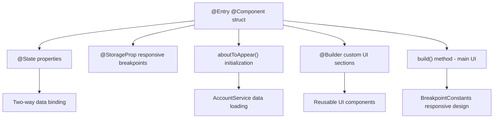

**Sources:** [entry/src/main/ets/pages/AccountDetail.ets L9-L22](https://github.com/CassiopeiaCode/account_app_harmonyos/blob/b27fde23/entry/src/main/ets/pages/AccountDetail.ets#L9-L22)

## Navigation System

该应用使用HarmonyOS路由系统实现页面间的导航。路由系统支持页面间传递参数并维护导航历史。

### Router Integration

页面通过 `router.getParams()` 接收导航参数，并可在初始化期间访问传递的数据。导航系统支持：

* **参数传递**：在页面之间传递的结构化数据，包括时间范围和账户类型
* **路由历史**: 内置的返回导航支持
* **动态路由**：基于用户操作和数据状态的运行时导航

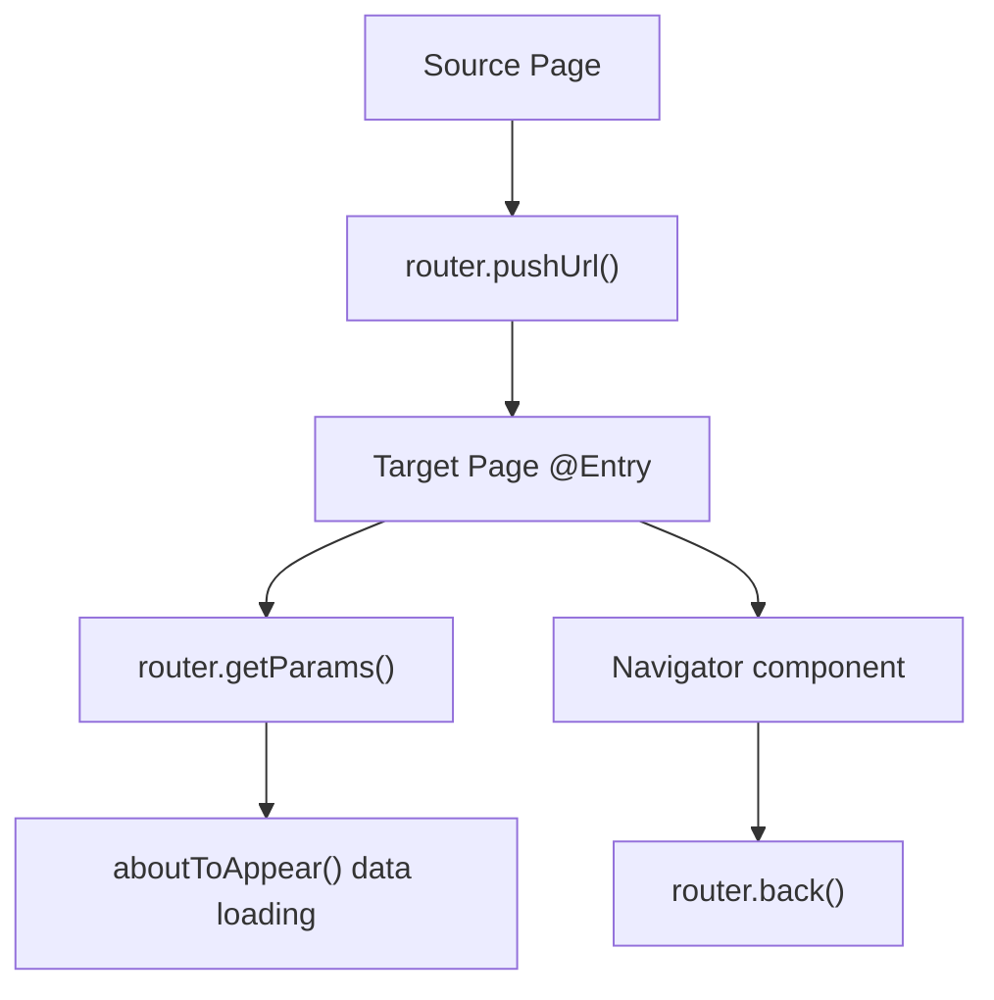

**Sources:** [entry/src/main/ets/pages/AccountDetail.ets L1-L18](https://github.com/CassiopeiaCode/account_app_harmonyos/blob/b27fde23/entry/src/main/ets/pages/AccountDetail.ets#L1-L18)

## Page Architecture Integration

应用页面通过明确定义的接口和服务调用与整体系统架构集成。页面作为展示层，协调用户交互与业务逻辑服务之间的关系。

### Data Flow Pattern

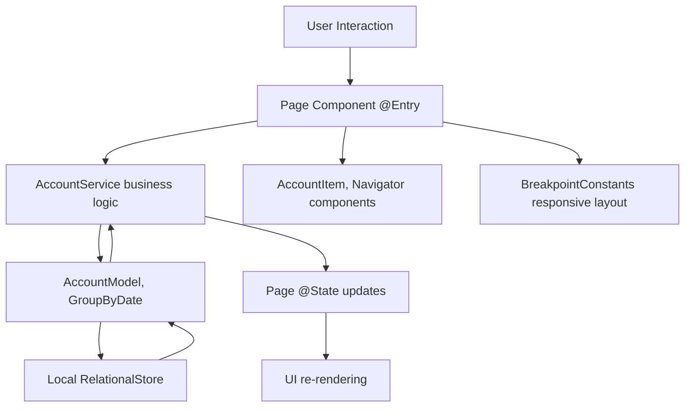

**Sources:** [entry/src/main/ets/pages/AccountDetail.ets L4-L21](https://github.com/CassiopeiaCode/account_app_harmonyos/blob/b27fde23/entry/src/main/ets/pages/AccountDetail.ets#L4-L21)

页面生命周期与响应式设计

页面通过应用的断点系统实现响应式设计，并通过HarmonyOS框架钩子管理其生命周期。

### Responsive Layout Integration

所有页面均集成 `BreakpointConstants` 以实现不同屏幕尺寸下的自适应布局。响应式系统通过 `@StorageProp` 在屏幕尺寸变化时响应式更新布局。

| Lifecycle Phase | Responsibility | Implementation |
| --- | --- | --- |
| `aboutToAppear()` | Data initialization, service calls | Async data loading from AccountService |
| `build()` | UI construction | Declarative ArkTS component tree |
| State Updates | Reactive UI updates | `@State` property changes trigger re-renders |
| Responsive Updates | Layout adaptation | `@StorageProp` breakpoint changes |

### Page Content Organization

页面通过使用一致的布局模式来组织其内容：

* **页眉部分**: 导航组件和页面标题
* **内容容器**：主要内容，响应式宽度限制
* **数据展示**：根据页面用途选择列表、网格或详细视图
* **背景与样式**：一致的配色方案和间距

**Sources:** [entry/src/main/ets/pages/AccountDetail.ets L14-L76](https://github.com/CassiopeiaCode/account_app_harmonyos/blob/b27fde23/entry/src/main/ets/pages/AccountDetail.ets#L14-L76)

## Main Application Pages

该应用程序包含多个主要页面，这些页面负责处理账户管理的不同方面：

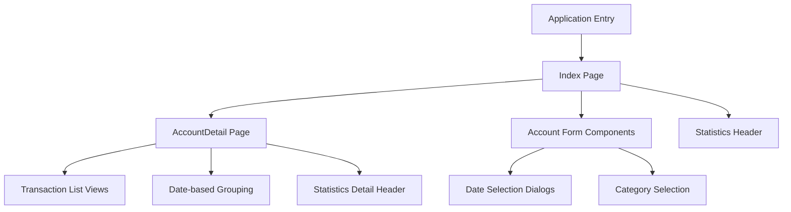

账户详情页结构

`AccountDetail` 页面展示了标准页面架构及其事务查看功能的实现。它展示了：

* **基于参数的初始化**：从路由器接收时间范围和账户类型的参数
* **服务集成**：使用 `AccountService` 进行数据检索和处理
* **自定义构建器**：实现 `GroupHeader` 构建器以用于基于日期的分节标题
* **响应式设计**：根据当前断点调整内容宽度
* **组件构成**：集成 `Navigator`、`AccountItem` 及其他可重用组件

**Sources:** [entry/src/main/ets/pages/AccountDetail.ets L11-L77](https://github.com/CassiopeiaCode/account_app_harmonyos/blob/b27fde23/entry/src/main/ets/pages/AccountDetail.ets#L11-L77)

# Account-Detail-Page.md
# Account Detail Page

> **Relevant source files**
> * [entry/src/main/ets/pages/AccountDetail.ets](https://github.com/CassiopeiaCode/account_app_harmonyos/blob/b27fde23/entry/src/main/ets/pages/AccountDetail.ets)

本页面文档说明账户详情页面（`AccountDetail`），该页面以按时间顺序分组的列表格式展示按日期范围和账户类型过滤的交易记录。该页面接收导航参数，并以每日摘要总计的形式展示详细的交易数据。

关于主要应用页面概述的信息，请参见 [Application Pages](/CassiopeiaCode/account_app_harmonyos/6-application-pages)。关于此页面中使用的账户显示组件的详细信息，请参见 [Account Management Components](/CassiopeiaCode/account_app_harmonyos/5.1-account-management-components)。

## Purpose and Scope

账户明细页面作为交易记录的筛选视图，按指定的时间范围和账户类型（支出或收入）对交易进行日期分组显示。该页面提供：

* 按日期分组显示交易列表
* 所选账户类型的每日汇总总额
* 导航栏包含页面标题
* Responsive layout adaptation
* 与应用程序的路由系统集成

导航与数据流

账户详情页面采用参数驱动的数据加载模式，其中导航参数决定了显示的内容。

```

```

数据流处理涉及：

1. **参数提取**：页面从路由参数中获取 `startTime`、`endTime` 和 `accountType` [entry/src/main/ets/pages/AccountDetail.ets L17-L18](https://github.com/CassiopeiaCode/account_app_harmonyos/blob/b27fde23/entry/src/main/ets/pages/AccountDetail.ets#L17-L18)
2. **数据加载**：`AccountService.getRangeAccountByType()` 获取过滤后的记录 [entry/src/main/ets/pages/AccountDetail.ets]

20](https://github.com/CassiopeiaCode/account_app_harmonyos/blob/b27fde23/entry/src/main/ets/pages/AccountDetail.ets#L20-L20)
3. **数据分组**：`AccountService.groupByDate()` 按日期对记录进行分组 [entry/src/main/ets/pages/AccountDetail.ets

21](https://github.com/CassiopeiaCode/account_app_harmonyos/blob/b27fde23/entry/src/main/ets/pages/AccountDetail.ets#L21-L21)
4. **状态更新**：分组数据更新`accountList`状态以用于UI渲染

Sources: [entry/src/main/ets/pages/AccountDetail.ets L16-L22](https://github.com/CassiopeiaCode/account_app_harmonyos/blob/b27fde23/entry/src/main/ets/pages/AccountDetail.ets#L16-L22)

组件结构与状态管理

`AccountDetail` 组件维护三个关键的状态属性，这些属性控制其行为和显示：

| State Property | Type | Purpose |
| --- | --- | --- |
| `accountType` | `AccountType` | Determines expense vs income filtering and display labels |
| `accountList` | `GroupByDate[]` | Contains grouped transaction records for rendering |
| `currentBreakpoint` | `string` | Manages responsive layout adaptations |

```

```

Sources: [entry/src/main/ets/pages/AccountDetail.ets L12-L14](https://github.com/CassiopeiaCode/account_app_harmonyos/blob/b27fde23/entry/src/main/ets/pages/AccountDetail.ets#L12-L14)

## 用户界面布局与渲染模式

该页面采用分层布局结构，结合基于日期的分组和响应式设计考虑。

### Date Group Headers

GroupHeader 构建器创建特定日期的表头，这些表头显示：

* 使用 `dayjs` 格式化日期 (`MM月DD日` 格式)
* 基于账户类型（支出或收入）的每日总计
* 使用分隔符进行视觉分隔

```

```

Sources: [entry/src/main/ets/pages/AccountDetail.ets L24-L44](https://github.com/CassiopeiaCode/account_app_harmonyos/blob/b27fde23/entry/src/main/ets/pages/AccountDetail.ets#L24-L44)

### List Structure

主要内容区域采用嵌套的`List`和`ListItemGroup`结构：

```

```

Sources: [entry/src/main/ets/pages/AccountDetail.ets L46-L76](https://github.com/CassiopeiaCode/account_app_harmonyos/blob/b27fde23/entry/src/main/ets/pages/AccountDetail.ets#L46-L76)

## Responsive Design Integration

页面通过基于断点的宽度限制与应用程序的响应式设计系统集成：

| Breakpoint Property | Usage | Source |
| --- | --- | --- |
| `@StorageProp('currentBreakpoint')` | Reactive breakpoint state | [entry/src/main/ets/pages/AccountDetail.ets <br> 14](https://github.com/CassiopeiaCode/account_app_harmonyos/blob/b27fde23/entry/src/main/ets/pages/AccountDetail.ets#L14-L14) |
| `BreakpointConstants.max_content_size.getValue()` | Dynamic width calculation | [entry/src/main/ets/pages/AccountDetail.ets <br> 67](https://github.com/CassiopeiaCode/account_app_harmonyos/blob/b27fde23/entry/src/main/ets/pages/AccountDetail.ets#L67-L67) |

响应式行为确保在不同设备尺寸下内容宽度最佳，同时保持一致的填充和布局结构。

Sources: [entry/src/main/ets/pages/AccountDetail.ets

14](https://github.com/CassiopeiaCode/account_app_harmonyos/blob/b27fde23/entry/src/main/ets/pages/AccountDetail.ets#L14-L14)

 [entry/src/main/ets/pages/AccountDetail.ets

67](https://github.com/CassiopeiaCode/account_app_harmonyos/blob/b27fde23/entry/src/main/ets/pages/AccountDetail.ets#L67-L67)

## Component Dependencies

账户详情页面依赖于多个导入的组件和服务：

```

```

这种依赖结构使页面能够：

* 处理导航和参数传递
* 显示单独的交易记录
* 格式化日期和时间
* 加载并分组账户数据
* 适配不同屏幕尺寸

Sources: [entry/src/main/ets/pages/AccountDetail.ets L1-L7](https://github.com/CassiopeiaCode/account_app_harmonyos/blob/b27fde23/entry/src/main/ets/pages/AccountDetail.ets#L1-L7)

# Development-Guide.md
# Development Guide

> **Relevant source files**
> * [.gitignore](https://github.com/CassiopeiaCode/account_app_harmonyos/blob/b27fde23/.gitignore)
> * [entry/.gitignore](https://github.com/CassiopeiaCode/account_app_harmonyos/blob/b27fde23/entry/.gitignore)
> * [entry/oh-package.json5](https://github.com/CassiopeiaCode/account_app_harmonyos/blob/b27fde23/entry/oh-package.json5)

本文件为开发者在account_app_harmonyos项目中的开发提供全面指导。内容涵盖开发环境搭建、项目结构、构建流程以及特定于该HarmonyOS会计助手应用的开发工作流程。

如需了解整体项目架构，请参见 [Application Architecture](/CassiopeiaCode/account_app_harmonyos/3-application-architecture)。如需了解项目配置和构建系统具体细节，请参见 [Project Configuration](/CassiopeiaCode/account_app_harmonyos/2-project-configuration)。

## Development Environment Requirements

### HarmonyOS Development Setup

该项目需要一个正确配置的HarmonyOS开发环境，包含以下组件：

| Component | Purpose | Notes |
| --- | --- | --- |
| DevEco Studio | Primary IDE | HarmonyOS official development environment |
| HarmonyOS SDK | Platform APIs | Required for @ohos modules |
| ArkTS Compiler | TypeScript compilation | Handles .ets files |
| hvigor Build Tool | Build automation | Configured in hvigorfile.ts |

### Development Dependencies

```

```

**Sources:** [entry/oh-package.json5 L1-L11](https://github.com/CassiopeiaCode/account_app_harmonyos/blob/b27fde23/entry/oh-package.json5#L1-L11)

 [.gitignore

1-11](https://github.com/CassiopeiaCode/account_app_harmonyos/blob/b27fde23/.gitignore#L1-L11)

 [entry/.gitignore L1-L6](https://github.com/CassiopeiaCode/account_app_harmonyos/blob/b27fde23/entry/.gitignore#L1-L6)

## 项目结构与约定

### Module Organization

该项目遵循HarmonyOS模块规范，具有清晰的职责分离：

```

```

**Sources:** [entry/oh-package.json5 L1-L11](https://github.com/CassiopeiaCode/account_app_harmonyos/blob/b27fde23/entry/oh-package.json5#L1-L11)

### File Naming Conventions

该项目在不同文件类型中遵循一致的命名模式：

| File Type | Convention | Example |
| --- | --- | --- |
| Page Components | PascalCase.ets | `AccountDetail.ets` |
| Reusable Components | PascalCase.ets | `AccountItem.ets` |
| Data Models | ModelSuffix.ets | `AccountModel.ets` |
| Service Classes | ServiceSuffix.ets | `AccountService.ets` |
| Utility Classes | UtilSuffix.ets | `PreferenceUtil.ets` |
| Configuration | kebab-case.json5 | `oh-package.json5` |

## Development Workflow

### Package Management

该项目通过 `oh-package.json5` 文件采用 HarmonyOS 特定的包管理：

```

```

**Sources:** [entry/oh-package.json5 L1-L11](https://github.com/CassiopeiaCode/account_app_harmonyos/blob/b27fde23/entry/oh-package.json5#L1-L11)

### Version Control Integration

该项目包含针对鸿蒙系统开发的全面 `.gitignore` 配置：

**Root Level Exclusions:**

* `/node_modules` - Node.js 依赖项
* `/oh_modules` - 鸿蒙系统模块
* `/local.properties` - 本地配置
* `/.idea` - IDE特定文件
* `**/build` - 构建输出目录
`/.hvigor` - 构建工具缓存

**Entry Module Exclusions:**

* `/.preview` - 预览构建产物
* `/.cxx` - 原生代码构建产物
`/.test` - 测试输出文件

**Sources:** [.gitignore

1-11](https://github.com/CassiopeiaCode/account_app_harmonyos/blob/b27fde23/.gitignore#L1-L11)

 [entry/.gitignore L1-L6](https://github.com/CassiopeiaCode/account_app_harmonyos/blob/b27fde23/entry/.gitignore#L1-L6)

## 构建过程与部署

### Build Configuration Hierarchy

```

```

**Sources:** [entry/oh-package.json5 L1-L11](https://github.com/CassiopeiaCode/account_app_harmonyos/blob/b27fde23/entry/oh-package.json5#L1-L11)

### 构建命令和目标

Hvigor 构建系统支持多种构建目标和配置：

| Command | Purpose | Output |
| --- | --- | --- |
| `hvigor clean` | Clean build artifacts | Removes build/ directories |
| `hvigor assembleHap` | Build HAP package | Generates .hap file |
| `hvigor installHap` | Install to device | Deploys to connected device |
| `hvigor build` | Full build process | Complete compilation and packaging |

## 代码组织最佳实践

### Service Layer Pattern

该应用程序实现了清晰的服务层模式，采用依赖注入：

```

```

**Sources:** [entry/oh-package.json5 L1-L11](https://github.com/CassiopeiaCode/account_app_harmonyos/blob/b27fde23/entry/oh-package.json5#L1-L11)

### Responsive Design Implementation

该项目通过断点系统实现响应式设计：

| Breakpoint | Screen Size | Layout Adaptation |
| --- | --- | --- |
| `sm` | Small screens | Single column layout |
| `md` | Medium screens | Dual column layout |
| `lg` | Large screens | Multi-column with sidebars |

## Testing and Debugging

### Development Environment Configuration

为实现有效的开发和调试，请确保正确配置以下内容：

1. **DevEco Studio 设置** - 为鸿蒙系统开发进行配置
2. **设备连接** - USB调试 或 模拟器设置
3. **日志监控** - HiLog集成用于运行时调试
4. **断点调试** - ArkTS 调试器配置

### Common Development Tasks

| Task | Location | Key Files |
| --- | --- | --- |
| Add new UI component | `entry/src/main/ets/components/` | Component.ets files |
| Modify database schema | `entry/src/main/ets/model/` | AccountModel.ets |
| Update business logic | `entry/src/main/ets/service/` | Service classes |
| Add new page | `entry/src/main/ets/pages/` | Page.ets files |
| Modify resources | `entry/src/main/resources/` | JSON and media files |

**Sources:** [entry/oh-package.json5 L1-L11](https://github.com/CassiopeiaCode/account_app_harmonyos/blob/b27fde23/entry/oh-package.json5#L1-L11)

 [.gitignore

1-11](https://github.com/CassiopeiaCode/account_app_harmonyos/blob/b27fde23/.gitignore#L1-L11)

 [entry/.gitignore L1-L6](https://github.com/CassiopeiaCode/account_app_harmonyos/blob/b27fde23/entry/.gitignore#L1-L6)

# Development-Environment.md
# Development Environment

> **Relevant source files**
> * [.gitignore](https://github.com/CassiopeiaCode/account_app_harmonyos/blob/b27fde23/.gitignore)
> * [entry/.gitignore](https://github.com/CassiopeiaCode/account_app_harmonyos/blob/b27fde23/entry/.gitignore)
> * [entry/oh-package.json5](https://github.com/CassiopeiaCode/account_app_harmonyos/blob/b27fde23/entry/oh-package.json5)

本页面文档说明开发HarmonyOS会计助手应用所需的开发环境配置、依赖项和构建配置。内容涵盖包管理、构建系统配置、IDE设置及开发流程。

关于整体项目结构和应用程序元数据的信息，请参见 [Project Configuration](/CassiopeiaCode/account_app_harmonyos/2-project-configuration)。关于构建系统内部机制的详细信息，请参见 [Build System](/CassiopeiaCode/account_app_harmonyos/2.2-build-system)。

## Development Prerequisites

HarmonyOS会计应用需要特定的开发环境，包括与HarmonyOS兼容的开发工具和包管理系统。

### Required Development Tools

```

```

**Development Environment Setup**

| Component | Purpose | Configuration |
| --- | --- | --- |
| `DevEco Studio` | Primary IDE for HarmonyOS development | Required for ArkTS support and device debugging |
| `HarmonyOS SDK` | Platform APIs and build tools | Provides `@ohos` namespace modules |
| `hvigor` | Build automation and HAP packaging | Configured via `hvigorfile.ts` |
| `ohpm` | HarmonyOS package manager | Manages `oh_modules` dependencies |

Sources: [.gitignore

1-11](https://github.com/CassiopeiaCode/account_app_harmonyos/blob/b27fde23/.gitignore#L1-L11)

 [entry/.gitignore L1-L6](https://github.com/CassiopeiaCode/account_app_harmonyos/blob/b27fde23/entry/.gitignore#L1-L6)

项目结构与包管理

该应用采用模块化结构，结合HarmonyOS专用的包管理以及标准的Node.js工具链。

### Directory Structure

```

```

**Package Configuration Structure**

`oh-package.json5` 文件定义每个应用程序模块的模块元数据和依赖项：

| Field | Value | Purpose |
| --- | --- | --- |
| `name` | `"entry"` | Module identifier |
| `version` | `"1.0.0"` | Module version |
| `dependencies` | `{}` | External package dependencies |

Sources: [entry/oh-package.json5 L1-L9](https://github.com/CassiopeiaCode/account_app_harmonyos/blob/b27fde23/entry/oh-package.json5#L1-L9)

依赖与构建产物管理

开发环境通过忽略模式和缓存策略来管理多种类型的依赖项和构建产物。

忽略的目录和构建产物

```

```

**Dependency Types and Management**

| Dependency Type | Location | Purpose | Package Manager |
| --- | --- | --- | --- |
| HarmonyOS Modules | `/oh_modules` | Platform-specific packages | `ohpm` |
| Node.js Modules | `/node_modules` | Build tools and utilities | `npm` |
| Build Cache | `/.hvigor` | Build system optimization | `hvigor` |
| Preview Cache | `/.preview` | Development preview assets | `DevEco Studio` |

Sources: [.gitignore

1-11](https://github.com/CassiopeiaCode/account_app_harmonyos/blob/b27fde23/.gitignore#L1-L11)

 [entry/.gitignore L1-L6](https://github.com/CassiopeiaCode/account_app_harmonyos/blob/b27fde23/entry/.gitignore#L1-L6)

## 开发流程与构建流程

开发环境支持开发和生产构建流程，并集成了工具。

构建与开发工作流程

```

```

**Development Environment Configuration**

该环境支持多种开发模式和构建目标：

| Configuration | File Location | Purpose |
| --- | --- | --- |
| Build Profile | `build-profile.json5` | SDK versions and build targets |
| Local Properties | `local.properties` | Developer-specific settings |
| Package Config | `entry/oh-package.json5` | Module dependencies and metadata |
| Build Script | `hvigorfile.ts` | Custom build logic and tasks |

Sources: [.gitignore

3](https://github.com/CassiopeiaCode/account_app_harmonyos/blob/b27fde23/.gitignore#L3-L3)

 [entry/.gitignore L3-L4](https://github.com/CassiopeiaCode/account_app_harmonyos/blob/b27fde23/entry/.gitignore#L3-L4)

## IDE集成与开发支持

开发环境与DevEco Studio集成，并支持额外的开发工具以提高生产力。

### Integrated Development Features

```

```

**Development Tool Configuration**

| Tool | Configuration File | Purpose | Integration Level |
| --- | --- | --- | --- |
| DevEco Studio | `/.idea/*` | Project settings and preferences | Primary IDE |
| Clang Language Server | `/.clangd` | Code completion and analysis | Native code support |
| Code Formatter | `/.clang-format` | Consistent code styling | Automated formatting |
| Static Analyzer | `/.clang-tidy` | Code quality checks | Build integration |

Sources: [.gitignore

4-11](https://github.com/CassiopeiaCode/account_app_harmonyos/blob/b27fde23/.gitignore#L4-L11)

 [entry/.gitignore

2](https://github.com/CassiopeiaCode/account_app_harmonyos/blob/b27fde23/entry/.gitignore#L2-L2)
